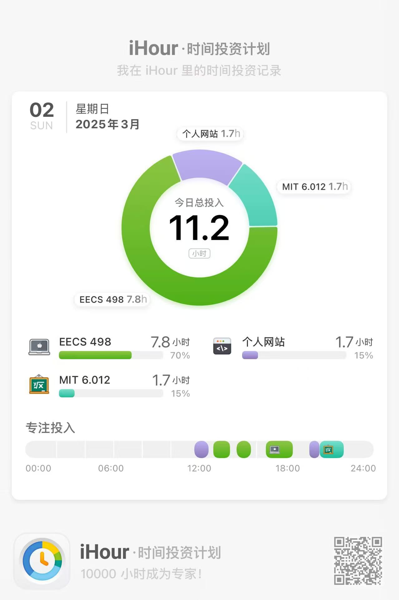

	今天花了几乎一整天的时间完成EECS498-A2，并且只是A2的一部分(Linear Classifier)。真的好难。矩阵求导、链式法则、各种巧妙的变形，越发觉得学好线性代数的重要性，以及数学在其中扮演的重要角色。很多技巧也可以用到数学当中。很多时候都搞不太懂矩阵的形状，不知道怎么运算才是正确的。哎~慢慢来吧

​	下午去A+俱乐部面试了，感觉尚可，介绍的时候还是有点紧张。说实话不知道自己在焦虑什么，明明这个是~~十拿九稳的事情~~。不过也算是了却了自己的分享欲和展示欲吧。

​	晚上还有很多事情，感觉每天都在努力学习，不过感觉没有真正搞懂，效益不大。下周可以适当调整一下，比如把相关的知识掌握牢靠再继续学，i.e.矩阵求导，反向传播。我喜欢拿csdiy里的一句话激励自己：“只有一个念头，就是你正在变强。”

​	最近课内的压力也很大，数分、大物都开始上难度了，大物真的好难，只能靠考前做题+拟合了。概统的话以后还是不去上课了，多看书吧。

​	好久没去打球了，感觉身体真的要生锈了。

​	今天天气很好，面试结束之后去机电大草坪逛了一圈，草坪上长满了人。好多人在拍照，真好。

​	还是继续努力吧。

补一个今天的学习时间：