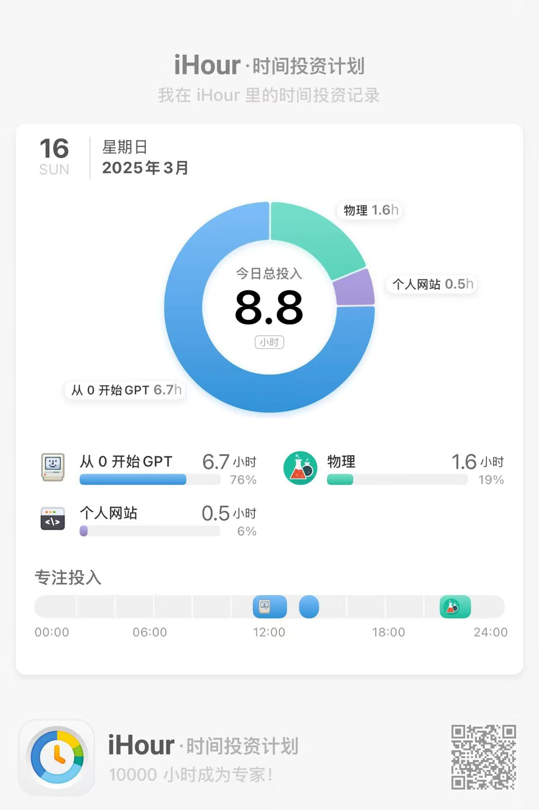

上午去储才面试了。多谢学长学姐不杀之恩，没有怎么拷打我。不过我说不出来具身智能的定义，感觉自己笨笨的。

下午去和学长学姐打了一个小时快乐羽毛球，学姐人真好，给我讲了信息差的重要性，确实啊，很多成功的人不是说他们有多聪明，只是他们了解的东西比别人要多，知道怎么做是最省时的，然后向着“捷径”的方向努力。不过我个人认为我在这方面做的还蛮好的~

今天晚上有百团大战和水灯节，不过我没有去，因为没有人陪我（呜呜呜） 好吧，其实是因为我太懒了，打完球真的累了，而且今天的任务还有一点尾巴。

