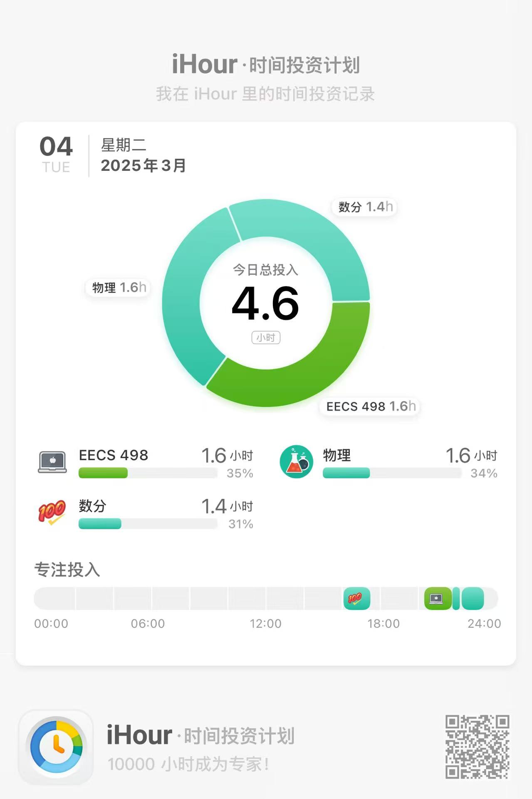

今天下午去游泳了，好久游泳了，前面还在水里扑腾，泳镜又没带紧。不过基本动作还没怎么忘，水里是真的冷啊，老师又不让乱游。。

今天C++课大概把昨天遗留下来的svm问题看懂了，以后还要多复习。

哇哈哈！！终于把cuda装好了，我真服了，本来C盘都满了，装完cuda之后反而多了10个G？很神奇吧！

夏老师让我参加他们的课题组，都开始为国创赛准备了。没想到去年还在当志愿者，今年就要帮上忙了（虽然不一定能帮上啥大忙）

贴个使用时间：

