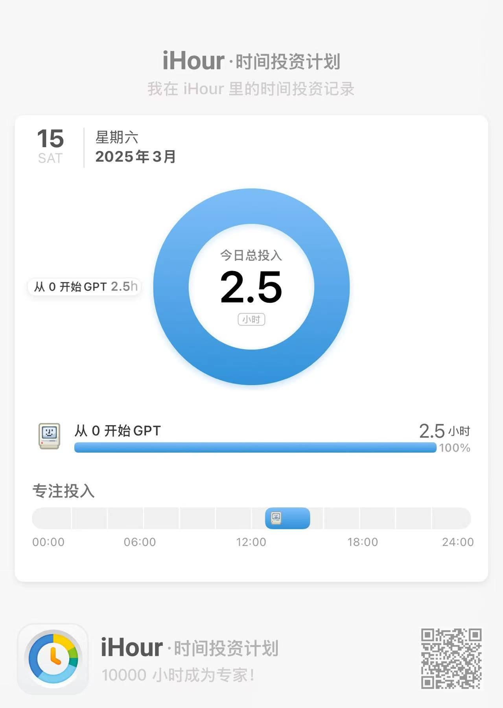

一开始以为百团大战是今天，到了光体之后才发现是明天，哈哈哈。不过呢，来都来了嘛，顺便去程及美术馆逛了一圈。来交大一个学期多了，包图也去过一百多次的选手，竟然没去过程及美术馆？因为我太忙了（都是借口）。里面有点像博物馆，定期还会换展品，不错不错。不过艺术品我还是欣赏不太来，感觉画的大差不差，其实就是我艺术造诣太低了。

晚上和室友出去爽吃红旗牛肉，人均45，真是吃爽了。羊肉也不腥，分量还挺足，甚至连葱油拌面都没吃完。感觉真幸福啊。希望在交大的这几年里能够把学校外面的馆子都吃一遍。

吃完饭就去练琴了。换琴弦的时候一弦又断了，心碎💔。最后直接去弹钢琴了，看b站教程简单学习了一下键位，然后找了《月球上的人》的简谱弹了弹（当然是单手的），感觉熟练之后也还好。下次还弹钢琴！

