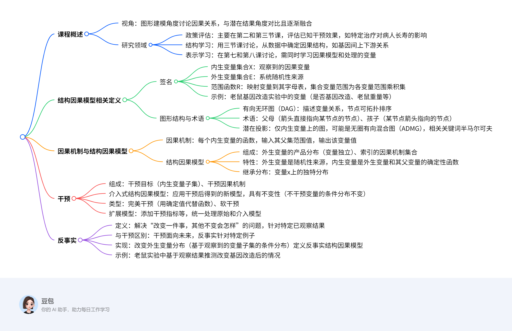
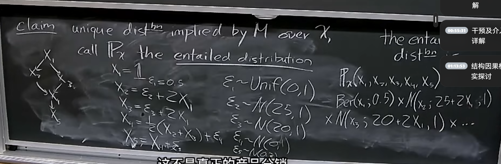

# Structural Causal Model

|                         | Known Model | Known Variables |
| ----------------------- | ----------- | --------------- |
| Policy Evaluation       | ✅           | ✅               |
| Structure Learning      | ❌           | ✅               |
| Representation Learning | ❌           | ❌               |

## Def1

A signature $\mathcal{S}$ consists of:

- $\mathcal{X}$ - a set of endogenous variables
- $\epsilon$ - a set of exogenous variables
- A range function $\mathcal{R}$ mapping $V \in X \epsilon$ to its alphabet $\mathcal{R}(V)$

$R(\mathbb{V})$ = $X_{V \in \mathcal{V}} \mathcal{R}(V)$

$\mathcal{G}$ directed acyclic graph(DAG) over $\mathcal{X}$

- $pa_{\mathcal{G}}(X_i)$ parents
- $ch_{\mathcal{G}}(X_i)$ children
- $an_{\mathcal{G}}(X_i)$ ancestors
- $de_{\mathcal{G}}(X_i)$ descendants
- $\tilde{pa}_{\mathcal{G}}(X_i)$ inclusive parents & $X_i$

## Def2

A DAG $\tilde{\mathcal{G}}$ over nodes $\mathcal{G} \cup \epsilon$ is compatible with signature $S$ if $pa_{\mathcal{G}}(\epsilon_i) = \emptyset$,$\forall \epsilon_i \in \epsilon$.We call $(\tilde{\mathcal{G}},S)$ a template.

## Def 3 ADMG

the latent projection of G denoted G(X) is a mixed graph w/:

$X_i->X_j$ if $X_i->X_j$ in G

$X_i<->X_j$ if $\exist \epsilon_k \in \epsilon$ s.t. $\epsilon_k -> X_i$,$\epsilon_k -> X_j$

We call $\tilde{\mathcal{G}}$ Markovian if $|ch_{\mathcal{G}}(\epsilon)| \leq 1$,thus its latent projection is itself.

##  因果机制（Causal Mechanism）

- 定义：针对系统中每个内生变量的函数，输入为该变量父集范围内的取值，输出为该变量的取值
- 作用：定量描述内生变量与其他变量（父变量）的关系

## 结构因果模型（Structural Causal Model, SCM）

- 定义：由两部分组成的模型
  - 外生变量的联合分布：外生变量之间相互独立的联合分布
  - 索引的因果机制集合：每个内生变量对应的因果机制函数
- 特性：外生变量是系统随机性的来源，内生变量是外生变量和其父变量的确定性函数

## 6. 继承分布（Entailed Distribution）

- 定义：由结构因果模型导出的、内生变量X上的唯一分布
- 生成方式：通过外生变量的分布和因果机制函数向前推演得到

## 7. 干预（Intervention）

- 定义：由干预目标和干预因果机制组成的操作
  - 干预目标：一组内生变量（被干预的节点）
  - 干预因果机制：针对干预目标变量的新因果机制函数
- 介入式结构因果模型：应用干预后得到的新结构因果模型，其中未被干预的变量保持原因果机制

## 8. 完美干预（Do-Intervention）

- 定义：一种特殊的干预，将干预目标变量的因果机制函数替换为一个确定值
- 符号：用“do(X=a)”表示，其中X为干预目标变量，a为设定的确定值

## 9. 反事实（Counterfactual）

- 定义：用于回答“若改变某件事而其他条件不变，结果会如何”的概念，针对特定已观察结果的例子
- 实现方式：通过改变外生变量的分布（基于观察到的变量子集的条件分布）构建反事实结构因果模型
- 与干预的区别：干预面向未来（如“若未来实施某措施，结果会怎样”），反事实针对已发生的特定案例（如“若过去某因素不同，结果会怎样”）