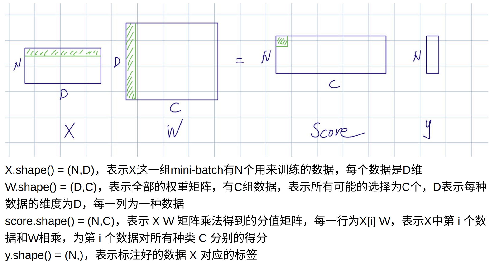

# SVM: 

​	$W:(D,C)$ $X:(N,D)$ $y:(N,)$

注：1. (N,)表示一维向量，既不是行向量也不是列向量。如果要显式的表示行向量(1,N)或者列向量(N,1),就要用.view(1,-1)或者.view(-1,1)。

2. $f(x_i,W)=W^Tx_i$ 其中$x_i$表示$X[i]$,即$X$的第$i$行，是个一维向量$(D,)$,不是行向量！（即你取行/列都会降维）
3. 不管是什么乘法（矩阵和矩阵，矩阵和向量，点乘还是矩阵乘法），都用matmul()就好了，免得报错
4. $W$ 中行数$D$代表特征数，一般为RGB通道+像素值，可以认为这个特征数极大，包含了像素的所有信息；列数$C$表示种类数目，如CIFR-10提供了10种图片类别。$X$的行数$N$表示样本的数量，因数据库的大小不同而不同。

这里直接借用@z_z大佬的图：



$Loss$记得要平均，而且每次都是累加，不是赋值，否则都会被循环最后一次的取值给覆盖。还要记得正则化，一般是$L_2$norm（不用开根号！只需要取每个元素的平方再乘以正则化系数），即$R(W)=R\times \abs{W^2}$

**$dW$的计算方法**: 注意，求导是对$W$中的每个元素而言的。即$W$中每个元素变化一点，整个$L$损失函数的取值会如何变化。我们关注的是$W$而不是$X$！因为$W$才是我们训练出来的模型。

对于SVM而言，$L_i = \sum_{j\neq y_i}\max(0,s_j-s_{y_i}+1)$

## 循环法

计算$\frac{\partial L_i}{dW}$需要分两种情况，但是总体思想都是用*链式法则*

$\frac{\partial L_i}{\partial W} = \frac{\partial L_i}{\partial s_i}\frac{\partial s_i}{dW}$ $s_i$代表对于第$i$个样本所得到的score，使用$W^Tx_i$计算得到的，这样的好处是我们很容易知道$\frac{\partial s_i}{\partial W}$等于$x_i$

推导：对于某个确定的$i$而言，$s_i=W^T x_i$,$ds_i=d(W^T)x_i+W^Tdx_i=(dW)^Tx_i$,两边同时取迹,有$s_i=tr(s_i)=tr((dW)^Tx_i)=tr(x_i^TdW)$,因此$\frac{\partial s_i}{\partial W}=x_i$。当$j=y[i]$时，说明是正确的标签，对损失函数贡献为0，自然导数也为0.当$j\neq y_i$且$L_i>0$时，对于正确类别而言，由$L_i = \sum_{j\neq y_i}\max(0,s_j-s_{y_i}+1)$不难看出，$\frac{\partial L}{\partial s_{y_i}}=-1$,因此有链式法则相乘，梯度减去$-X[i]$。同理，对于错误类别，导数为1，那么梯度应该加上$X[i]$。

代码实现:

```python
def svm_loss_naive(W: torch.Tensor, X: torch.Tensor, y: torch.Tensor, reg: float):
    dW = torch.zeros_like(W)  # initialize the gradient as zero
    num_classes = W.shape[1]
    num_train = X.shape[0]
    loss = 0.0
    for i in range(num_train):
        scores = W.t().mv(X[i])
        correct_class_score = scores[y[i]]
        for j in range(num_classes):
            if j == y[i]:
                continue
            margin = scores[j] - correct_class_score + 1  
            if margin > 0:
                loss += margin
                dW[:,y[i]] -= X[i]
                dW[:,j] += X[i]
    loss /= num_train
    loss += reg * torch.sum(W * W)
    dW_regular = 2 * reg * W
    dW += dW_regular
	return loss, dW

```


## 向量化法

特点：直接对整个矩阵进行操作，而不是抽某一行/列。（省时，并发）

为了不使用循环而选出每一个样本正确类别对应的分数，采用一个非常巧妙的办法取出数据，那就是让行数和列数一一对应，形成有序的数对（类似zip），即行和列两个位置不放数字，放两个形状相同的tensor。这里我们希望在第一个样本取出数据后自动到第二个样本，那么我们可以建立自然数(0~N-1)与正确标签y的一一映射，前者可以用torch.arange(N)实现。但是取出来之后是个一维张量，我们需要将其reshape成二维列向量(N,1)。

计算损失矩阵(不妨设为margin)时可以充分利用广播机制代替循环，广播机制会将(N,1)复制成(N,C),每一行都是相同的数字，也就是正确序号对应的分数。我们需要将最小值设成0，小于0的说明不会对损失函数造成影响，而大于0的我们需要注意：有两种情况，一种是本来就是对的，那么经过$L_i = \sum_{j\neq y_i}\max(0,s_j-s_{y_i}+1)$后会得到1，这种影响我们需要手动排除，因此需要直接赋值为0（过程同上述取数据）；如果是错的那就会对损失函数造成影响。最后别忘了损失函数是个标量，需要将矩阵各元素加和求平均再正则化。

而计算$dW$是一个难点，因为我们没办法再用循环的操作了，所以我们只能想办法用矩阵乘法来代替循环（比如说如果我们想要交换矩阵的相邻两列，我们不用循环的话可以用单位矩阵进行相同的变换后右乘得到）

我们先明确：对于margin而言，大于0的说明是错的，梯度应该为1；而对于本身正确的序号，由于一行里有多少次margin>0就有多少次$-s_{y_i}$,所以梯度需要减去大于0的元素个数（用sum,且指定dim=1，dim=1代表第二个维度消失，只剩下第一维度（如果用了keepdim=True代表保留求和的那个维度，只是维度变成1））

后面我自己没搞懂，先贴一个[Click here](assetes/支持向量机.pdf)
