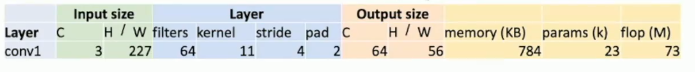

How to calculate?

Output size: C = number of filters

$H_{out}=W_{out}=(H_{in}-KernalSize+2\times Padding)/Stride + 1$

Memory:   Number of Elements=$C_{out}\times H'\times W'$

​	Bytes per element = 4(for 32-bit floating point)

​	KB =(number of elements)*(bytes per elem) / 1024

params : $C_{out}\times C_{in}\times K \times K+C_{out}$

Float operations:(multiply + add) because hardware can perform a floating point per clock cycle.

 (number of output elements) * (ops per output elem)

= $(C_{out}\times H' \times W') \times (C_{in} \times K \times K)$

For pooling layer: W’ = floor((W-K)/S + 1)