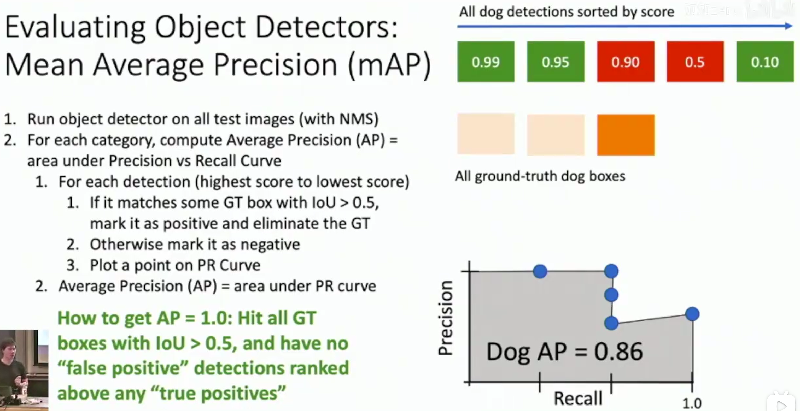
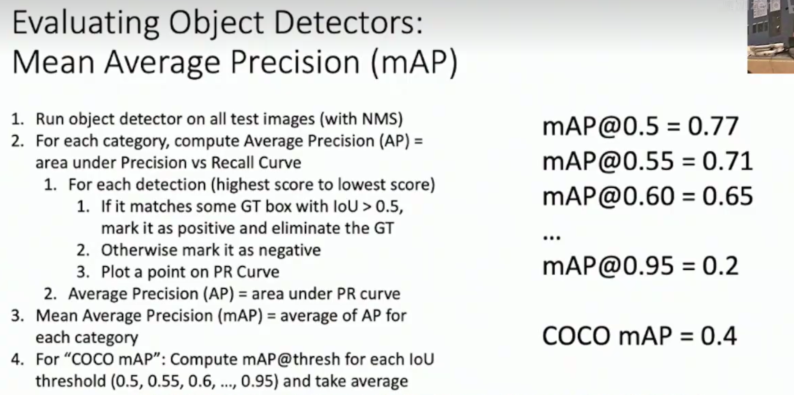

# Detect Multiple Objects

need four output numbers for each object: $(x,y,w,h)$ where w stands for width and h stands for height.

## Sliding Window : Apply a CNN to many different crops of the image,CNN Classifies each crop and object or background.

Questions: We have lots of combinations of possible picture sizes, and it will be a large parameter!

## Region Proposals

e.g. Selective search

Find a small set of boxes that are likely to cover all objects. Often based on heuristics: Look for “blob-like” image regions.

R-CNN: Region-Based CNN

Input Image ---> Regions of Interest(ROI) from a proposal method --> Warped Image Regions (224*224)

--> Forward each region through Convnet --> Class Prediction & Bounding box regression(Predict “transform” to correct the ROI: 4 numbers ($t_x,t_y,t_h,t_w$)

Region proposal: ($p_x,p_y,p_h,p_w$)   Transform:($t_x,t_y,t_h,t_w$) Output box:($b_x,b_y,b_h,b_w$)

Translate relative to box size: $b_x=p_x+p_wt_x \quad b_y=p_y+p_ht_y$

Log-space scale transform: $b_w=p_w\exp{t_w}\quad b_h=p_h\exp{t_h}$

mAP 检测指标 全称 Mean Average Precision

首先对于每一个类别计算Average Precision

准确率：按照预测概率高低排序，从高到低，在检测出来的对象中，正确的个数占检测出个数的比例 通过与实际框的交并比(IOU)阈值，一般是0.5，来判断是否正确

召回率：命中的个数占实际个数的比例

如何让AP=1.0？ 让所有的检测框与实际框的交并比大于0.5，并且排名靠前的全部都是真阳性，假阳性排在真阳性之后

在类别这一维度上计算平均值，再在不同IOU阈值上计算平均值

补充：在二分类问题中，** 真阳性（True Positive, TP）、假阳性（False Positive, FP）、假阴性（False Negative, FN）、真阴性（True Negative, TN）** 是基于模型预测结果与真实标签的对比定义的四个基本概念。它们是评估分类模型性能的基础，广泛应用于医学诊断、目标检测、活动识别等领域。以下是详细区分和说明：

### **一、核心定义与符号说明**

| 预测结果 \ 真实标签 | 正例（Positive） | 负例（Negative） |
| ------------------- | ---------------- | ---------------- |
| **预测为正例**      | 真阳性（TP）     | 假阳性（FP）     |
| **预测为负例**      | 假阴性（FN）     | 真阴性（TN）     |

- **正例（Positive）**：需要检测或识别的目标类别（如 “患病”“存在车辆”“挥手动作”）。
- **负例（Negative）**：非目标类别（如 “健康”“无车辆”“非挥手动作”）。

### **二、具体含义与示例**

#### 1. **真阳性（TP）**

- **定义**：模型正确预测为正例的样本数。
  **公式**：TP = 实际为正例且预测为正例的样本数。

- 示例

  ：

  - 医学检测：某患者实际患病（真实正例），模型预测为 “患病”（预测正例）→ TP。
  - 目标检测：图像中真实存在 “行人”（正例），模型检测到 “行人” 并正确分类→ TP。

#### 2. **假阳性（FP）**

- **定义**：模型错误预测为正例的样本数（“误报”）。
  **公式**：FP = 实际为负例但预测为正例的样本数。

- 示例

  ：

  - 医学检测：健康人（真实负例）被模型误诊为 “患病”（预测正例）→ FP。
  - 目标检测：图像中无 “自行车”（负例），模型错误检测到 “自行车”→ FP。

#### 3. **假阴性（FN）**

- **定义**：模型错误预测为负例的样本数（“漏报”）。
  **公式**：FN = 实际为正例但预测为负例的样本数。

- 示例

  ：

  - 医学检测：患者实际患病（真实正例），模型预测为 “健康”（预测负例）→ FN。
  - 活动识别：视频中人物真实在 “跑步”（正例），模型未检测到该动作→ FN。

#### 4. **真阴性（TN）**

- **定义**：模型正确预测为负例的样本数。
  **公式**：TN = 实际为负例且预测为负例的样本数。

- 示例

  ：

  - 医学检测：健康人（真实负例），模型预测为 “健康”（预测负例）→ TN。
  - 目标检测：图像中无 “动物”（负例），模型正确判断为 “无动物”→ TN。

### **三、关键指标与应用**

基于这四个指标，可以推导出多种评估模型性能的关键指标：

#### 1. **准确率（Accuracy）**

- **定义**：模型正确预测的样本占总样本的比例。
  **公式**：Accuracy=*TP*+*FP*+*FN*+*TN**TP*+*TN*​
- **局限性**：当正负样本不平衡时（如正例占比极低），准确率可能误导评估（例如 “永远预测负例” 也可能获得高准确率）。

#### 2. **精度（Precision）**

- **定义**：预测为正例的样本中，实际为正例的比例（衡量 “预测正例的可靠性”）。
  **公式**：Precision=*TP*+*FP**TP*​
- **场景**：适用于需要减少误报的场景（如癌症诊断，误报可能导致过度治疗）。

#### 3. **召回率（Recall，灵敏度）**

- **定义**：实际为正例的样本中，被正确预测的比例（衡量 “检测正例的能力”）。
  **公式**：Recall=*TP*+*FN**TP*​
- **场景**：适用于需要减少漏报的场景（如地震预警，漏报可能导致严重后果）。

#### 4. **F1 分数（F1-Score）**

- **定义**：精度和召回率的调和平均值，平衡两者的综合指标。
  **公式**：*F*1=2×Precision+RecallPrecision×Recall​
- **适用场景**：样本不平衡或需要综合评估精度与召回率时（如目标检测、活动识别）。

### **四、在 HAKE 中的应用示例**

以 HAKE 论文中的 “人类活动识别” 任务为例：

- **正例**：特定活动（如 “喝水”）。
- **负例**：非该活动（如 “行走”“站立”）。
- **TP**：真实为 “喝水” 且被模型正确识别为 “喝水” 的样本。
- **FP**：真实为 “非喝水”（如 “拿杯子”）但被模型误判为 “喝水” 的样本。
- **FN**：真实为 “喝水” 但被模型漏检（如未检测到 “头 - 接触杯子” 原语）的样本。
- **TN**：真实为 “非喝水” 且被模型正确判断为 “非喝水” 的样本。

通过统计 TP、FP、FN、TN，可计算 mAP 等指标（如 HAKE 在 HICO-DET 中通过减少 FP 和 FN，提升了 TP 比例，从而提高 mAP）。

### **五、总结：如何快速区分？**

- **真（T）**：预测与真实一致（TP、TN）。
- **假（F）**：预测与真实不一致（FP、FN）。
- **阳性（P）**：预测为正例（TP、FP）。
- **阴性（N）**：预测为负例（FN、TN）。

记住口诀：

- **TP**：真的是正例（模型说有，实际也有）。
- **FP**：假的是正例（模型说有，实际没有）。
- **FN**：假的是负例（模型说没有，实际有）。
- **TN**：真的是负例（模型说没有，实际也没有）。
