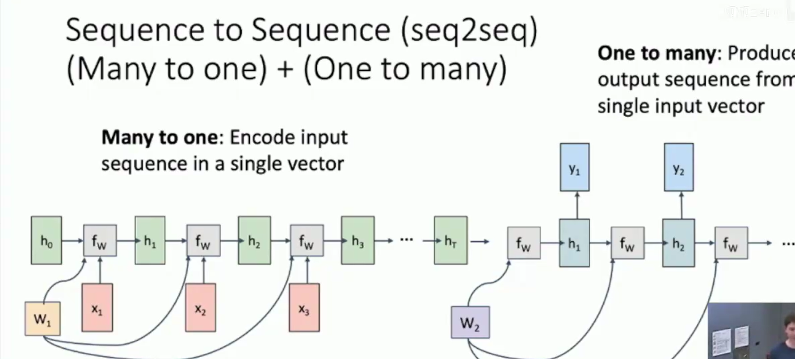
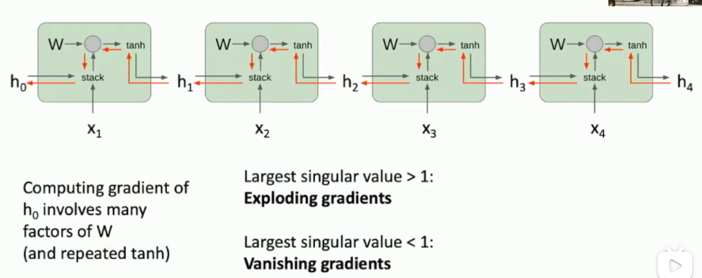

(Vanilla) Recurrent Neural Network

$h_t = f_w(h_{t-1},x_t)$  -->  $h_t = \tanh(W_{hh}h_{t-1}+W_{xh}x_t) \\ y_t = W_{hy}h_t$

Sequence 2 Sequence :

Many2One : Encode input sequence in a single vector

One2Many: Produce output sequence from single input vector

Truncated Backpropagation Thru Time: Chunk the data and backprop in the every small chunk . They will remember the hidden weights.

Vanilla RNN Gradient Flow

LSTM: $\sigma$ stands for sigmoid function

$\begin{aligned}\left(\begin{array}{l}i \\ f \\ o \\ g\end{array}\right) & =\left(\begin{array}{c}\sigma \\ \sigma \\ \sigma \\ \tanh \end{array}\right) W\binom{h_{t-1}}{x_t} \\ c_t & =f \odot c_{t-1}+i \odot g \\ h_t & =o \odot \tanh \left(c_t\right)\end{aligned}$

input gate: whether to write the cell

forget gate: whether to erase the cell

output gate: how much to reveal cell

gate gate: how much to write to cell