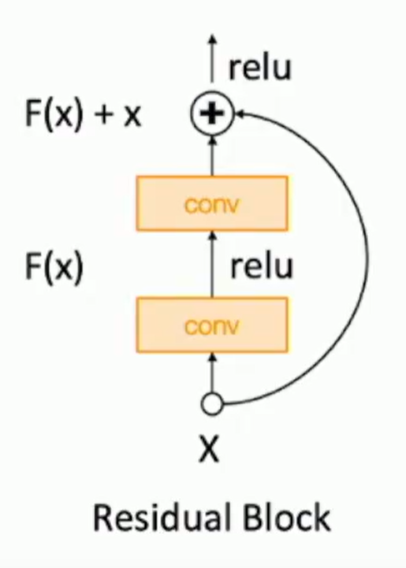

# One time setup

## Activation functions

Don’t use sigmoid or tanh because it will make gradients vanish.(they have flat region)

Sigmoid: non-zero-symmetric, it will be all positive/negative for gradients on W(each input is the activation output from the previous layer) So it will have zigzag shape in order to achieve the final optimization goal. Exponential is expensive for CPUs.

ReLU: converge very fast ; not zero-centered output; gradients are 0 if x is negative(dead ReLU: use a slightly positive biases ,say 0.01)

Leaky ReLU: will not die $f(x)=\max(0.01x,x)$

## Data Preprocessing

we want zero-centered data.

Common for images : - mean(per channel) / standard variation (per channel )

for non-images : whitening  covariance matrix is identity matrix

If we don’t normalize the data, classification loss vert sensitive to changes in weight matrix.

## Weight Initialization

Initializing matrix to all 0 is very bad! The network will not learn anything.

small random numbers(Gaussian with zero mean ) what about std?

If activation collapses to 0, it will make the local gradient to 0 because local gradient equals to the output activation from the previous layer. 

If activation all center around 1 and we use tanh as activation function, it will make the upstream gradient to be 0 because 1 is in the flat region of tanh gradient.

For tanh : Xavier initialization:$std = \sqrt{\frac{1}{Din}}$

We want the variance of output = variance of input

$y=Wx  \\ y_i = \sum_{j=1}^{Din}x_jw_j$

$Var(y_i)=Din\times Var(x_iw_i) \hfill \ [Assume\  x,w \ are \ iid] \\=Din\times (E[x_i^2]E[w_i^2]-E[x_i]^2E[w_i]^2) \hfill \ [Assume\ x,w\ independent]\\=Din\times Var(x_i)\times Var(w_i) \hfill  [Assume\ x_i,w_i \ are\  zero-mean]$ 

Note that $x_i,w_i$ are zero-mean,so $Var(x_i)=E[x_i^2]-E[x_i]^2=E[x_i^2]$

For ReLU: Kaiming initialization 

gain = $\sqrt2$  that is $std = \sqrt{\frac{2}{Din}}$

For residual networks, if we still use Kaiming initialization , we will double the variance every layer, because remember,

$Var(F(x)+x)=Var(F(x))+Var(x)=Var(x)+Var(x)=2Var(x)$

Solution: Initialize first conv with Kaiming, initialize second conv to zero.

## Regularization

L2 regularization(Weight decay);

Dropout:

Why? Forces the network to have a redundant representation ; Prevents co-adaptation of features.

Dropout is training a large ensemble of models that share parameters. Each binary mask is one model.

At test time we need accurate(fixed) dropout, so we need to multiply a dropout probability, which is expected output in training = output in testing

Dropout only occurs in the fully-connected layers.

Batch normalization : Training: Normalize using stats from random minibatches

​				Testing: Use fixed stats to normalize

## Data Augmentation

Transform image: Horizontal Flips, random crops and scales

Cutout and mixup for small classification datasets.

