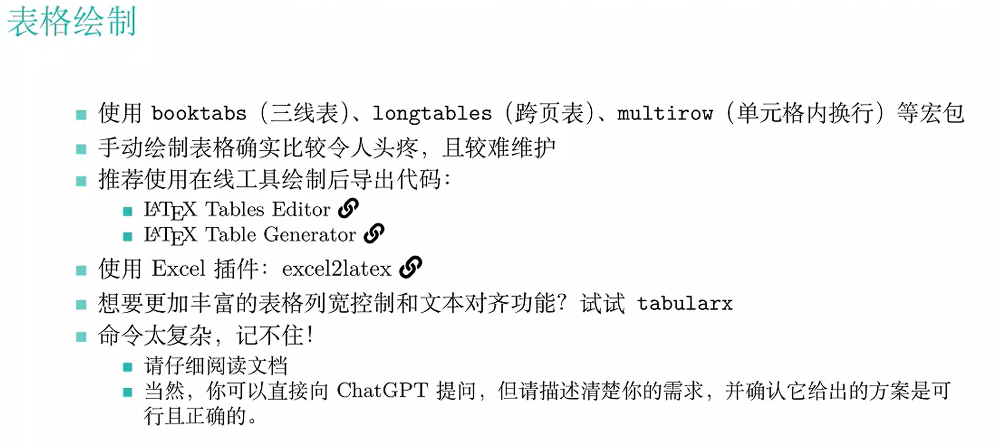

# Latex学习

## 文件结构

```latex
\documentclass{sjtu}  %文档类型
% 这里开始是导言区
\usepackage{graphicx} % 引用宏包
\graphicspath{{fig/}} % 设置图片目录
\def\rawcmd#1{\texttt{\color{DarkBlue}\footnotesize #1}}  % 定义新命令
% 导言区到此为止
\begin{document}
这里是正文
\end{document}
```

## Latex “命令”(宏或者控制系列)

- 简单命令

  - \命令   {\heiti 哈哈哈}
  - \命令[可选参数]{必选参数}

- 环境命令

  ```latex
  \begin{equation*}
  	a^2-b^2=(a+b)(a-b)
  \end{equation*}
  ```

  

## 谋篇布局

- 一篇学位论文包括
  - 标题： `` \title,\author,\date -> \maketitle``
  - 摘要：`abstract` 环境
  - 目录：`\tableofcontents`
  - 章节：`\chapter,\section,\subsection等`
  - 图表：`table,figure`环境
  - 引用：`\label,\cite,\ref `
  - 文献：`\bibliograpghy`
  - 附录：`\appendix`
  - 致谢：`acknowledgements`环境
- 文档划分
  - 页码划分：`\frontmatter,\mainmatter,\backmatter`
  - 分文件编译：`\include,\input`

## 文本标记

- 加粗：`{\bfserires ...}` 或 `\textbf{...}`
- 倾斜：`{\itshape ...}` 或 `\textit{...}`
- 字号：`\tiny,\small,\normalsize,\large,\huge`等
- 换行：`\\`
- 缩进: `\indent,\noindent`
- 居中：`\centering`或`center`环境

## Latex常用环境命令

- `table`: 用于创建一个表格环境
- `figure`: 用于创建一个图片环境
- `itemize`: 用于创建一个无编号列表，使用`\item`进行分店
- `enumerate`: 用于创建一个编号列表，使用`\item`进行分点
- `equation`: 用于创建一个公式环境，环境内适用行间公式语法

## Latex数学公式

- 用单个美元符号`$或\( \)` 包围起来的内容是**行内公式**
- 用两个美元符号`$$或\[ \]`包围起来的内容是**行间公式**
- 使用数学环境，例如`equation`环境内的公式会自动加上编号，`align`环境多用于多行公式（比如方程组、多个并列条件等）
- 寻找符号
  - 运行`textdoc symbols`查看符号表
  - `https://ctan.org/pkg/comprehensive`
  - 手写识别（有趣但不全）: Detexify
- Mathpix Snip 识别图片导出

## 交叉引用与插入插图

- 给对象命名：图片、表格、公式等

  `\label{name}`

- 引用对象

  `\ref{name}`

```latex
\begin{figure}[htbp]
\centering
\includegraphics[height=.2\textheight]{LOGO.png}
\caption{交大校徽}
\label{fig:sjtu:LOGO}
\end{figure}
交大校徽请参见图~\ref{fig:sjtu:LOGO}
```



## 作图与插图

- 外部插入
  - Mathematica MATLAB
  - PowerPoint
  - Matplotlib库
  - draw.io Processon
- 插图格式
  - .pdf或.eps
  - .jpg或.png
- 参考：[如何在论文中画出漂亮的插图？ - 知乎 (zhihu.com)](https://www.zhihu.com/question/21664179/answer/54632841)

## 文献管理

- .bib数据库

  - Google Scholar可直接复制，要注意校对

- 常用方法（大部分会议，期刊模板）： BibTex后端

  
