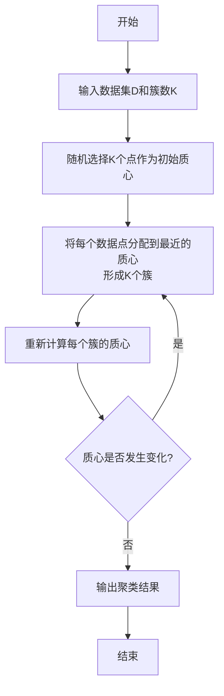
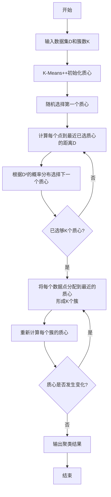

# 手撕KMeans & Kmeans++

## KMeans原理

K-Means是最经典的聚类算法之一，其核心思想是通过迭代过程，将数据集划分为K个簇，使得每个数据点都属于离它最近的均值（即簇中心）对应的簇。

### 算法步骤

1.  **输入**：
    *   数据集 $D = \{x_1, x_2, ..., x_n\}$
    *   预设的簇数量 $K$

2.  **输出**：
    *   $K$ 个簇 $C = \{C_1, C_2, ..., C_K\}$
    *   $K$ 个簇中心点 $\mu = \{\mu_1, \mu_2, ..., \mu_K\}$

3.  **步骤**：
    1.  **初始化**：从数据集 $D$ 中 **随机选择 K 个数据点** 作为初始的簇中心（质心）$\mu_1^{(0)}, \mu_2^{(0)}, ..., \mu_K^{(0)}$。
    2.  **迭代过程**：重复以下步骤直到簇中心不再发生变化（或变化很小，或达到最大迭代次数）。
        *   **分配步骤**：对于数据集中的每一个数据点 $x_i$：
            *   计算它到所有K个簇中心的距离（通常是欧氏距离）。
            *   将其分配给 **距离最近** 的那个簇中心所对应的簇。
            *   公式表示：$C^{(t)}_k = \{ x_i : \| x_i - \mu^{(t)}_k \|^2 \le \| x_i - \mu^{(t)}_j \|^2 \, \forall j, 1 \le j \le K \}$
        *   **更新步骤**：对于每一个簇 $C_k$：
            *   重新计算该簇的质心，即取该簇中所有数据点的平均值作为新的簇中心。
            *   公式表示：$\mu^{(t+1)}_k = \frac{1}{|C^{(t)}_k|} \sum_{x_i \in C^{(t)}_k} x_i$

### 流程图



---

## K-Means++ 算法

K-Means++是K-Means的改进算法，其主要优化在于 **初始质心的选择策略**。它通过一个概率方法，使得初始的簇中心点尽可能彼此远离，从而有效解决K-Means对初始值敏感、容易陷入局部最优的问题。

### 算法步骤

1.  **输入** 和 **输出** 与K-Means完全相同。

2.  **步骤**：
    1.  **初始化**：**谨慎地选择初始质心**。
        *   **a.** 从数据集 $D$ 中 **随机均匀地选择第一个簇中心** $\mu_1$。
        *   **b.** 对于每一个数据点 $x_i$，计算它到 **已选定的最近簇中心** 的距离，记为 $D(x_i)$。
        *   **c.** 按照概率 $\frac{D(x_i)^2}{\sum_{x_j \in D} D(x_j)^2}$ 选择一个数据点作为下一个簇中心。距离越远的点，被选中的概率越大。
        *   **d.** 重复步骤 **b** 和 **c**，直到选出 K 个簇中心。
    2.  **迭代过程**：**此后的步骤与标准K-Means完全一样**。
        *   **分配步骤**：将每个点分配到最近的质心所在的簇。
        *   **更新步骤**：根据当前簇的分配，重新计算每个簇的质心。
        *   重复以上两步直到收敛。

### 流程图



### 核心区别与总结

| 特征 | K-Means | K-Means++ |
| :--- | :--- | :--- |
| **核心思想** | 迭代重定位，最小化簇内平方误差 | 同K-Means，但改进了初始中心的选择 |
| **初始化** | **完全随机** | **概率化选择**，使初始中心点尽可能分散 |
| **优点** | 简单、高效、适用于大数据集 | **收敛速度更快**，**结果质量更高且更稳定** |
| **缺点** | **对初始值敏感**，容易陷入局部最优解 | 初始化过程比K-Means稍慢，但整体效率更高 |
| **结果** | 每次运行结果可能差异很大 | 结果更一致，全局最优解的可能性更高 |

**结论**：在实践中，**K-Means++ 几乎总是优于标准的 K-Means 算法**，因此它已成为许多机器学习库（如 Scikit-learn）中K-Means算法的默认初始化方法。

## KMeans代码

```python
import numpy as np

def calculate_distance(p1, p2):
    """计算两个点之间的欧几里得距离的平方，不开方可以加速计算"""
    return np.sum((p1 - p2) ** 2)

# 主函数
def my_kmeans(dataset: np.ndarray, K: int, max_iter: int = 100, tol: float = 1e-4):
    """
    K-Means 聚类算法实现

    Args:
        dataset (np.ndarray): 数据集 (N, D)，N个样本，D个特征
        K (int): 聚类的簇数
        max_iter (int): 最大迭代次数
        tol (float): 收敛阈值，质心变化的范数小于此值则认为收敛
    """
    
    # --- 第一步：初始化质心 ---
    # 你的 random_init 函数写得很好，可以直接用
    # 从数据集中随机选择K个点作为初始质心
    random_indices = np.random.choice(len(dataset), size=K, replace=False)
    centroids = dataset[random_indices]

    # --- 第四步：迭代（把分配和更新包起来）---
    for i in range(max_iter):
        print(f"--- Iteration {i+1} ---")
        
        #
        # 在这里保存旧的质心，用于后续比较是否收敛
        #
        old_centroids = centroids.copy() # 非常重要！需要用copy()深拷贝

        # --- 第二步：分配 (Assignment) ---
        # 创建一个数组，用来存储每个数据点所属的簇的索引 (0 到 K-1)
        clusters = np.zeros(len(dataset))
        
        # 遍历每一个数据点
        for point_idx, point in enumerate(dataset):
            # 计算该点到所有K个质心的距离
            distances = [calculate_distance(point, centroid) for centroid in centroids]
            
            # 找到最近的质心的索引
            closest_centroid_idx = np.argmin(distances)
            
            # 将该数据点分配给最近的簇
            clusters[point_idx] = closest_centroid_idx

        # --- 第三步：更新 (Update) ---
        # 遍历每一个簇 (0 到 K-1)
        for cluster_idx in range(K):
            # 筛选出属于当前簇的所有数据点
            # !!! 这是你需要重点修改的地方，使用Numpy的布尔索引
            points_in_cluster = dataset[clusters == cluster_idx]
            
            # 如果一个簇里没有任何点（极端情况），保持其质心不变
            if len(points_in_cluster) > 0:
                # 计算这些点的均值，作为新的质心
                # np.mean(..., axis=0) 会对所有点的每一个维度（列）求均值
                new_centroid = np.mean(points_in_cluster, axis=0)
                centroids[cluster_idx] = new_centroid
        
        # --- 检查是否收敛 ---
        # 计算新旧质心之间的变化量
        # np.linalg.norm 计算向量的范数（可以理解为距离）
        change = np.linalg.norm(centroids - old_centroids)
        print(f"Centroid change: {change}")

        if change < tol:
            print("Converged!")
            break
            
    # 返回最终的质心和每个点的分配结果
    return centroids, clusters
```

## KMeans++代码

```python
import numpy as np

def kmeans_plusplus_optimized(dataset: np.ndarray, K: int, max_iter: int = 300, tol: float = 1e-4):
    """Perform K-Means clustering with the K-Means++ initialization scheme.

    This function segments a dataset into K clusters using the K-Means algorithm.
    It uses the K-Means++ method for initializing the cluster centroids, which
    leads to better and more consistent results than random initialization.

    Parameters
    ----------
    dataset : numpy.ndarray
        The input data to cluster. A 2D array of shape (n_samples, n_features).
    K : int
        The number of clusters to form, as well as the number of centroids to generate.
    max_iter : int, optional
        The maximum number of iterations for the K-Means algorithm. 
        Defaults to 300.
    tol : float, optional
        The tolerance for convergence. If the Frobenius norm of the difference
        between the old and new centroids is less than `tol`, the algorithm stops.
        Defaults to 1e-4.

    Returns
    -------
    centroids : numpy.ndarray
        The final coordinates of the cluster centers. A 2D array of shape (K, n_features).
    clusters : numpy.ndarray
        An array of shape (n_samples,) where each element is the index of the
        cluster that the corresponding sample in the dataset belongs to.

    Notes
    -----
    The K-Means++ initialization algorithm was proposed by David Arthur and
    Sergei Vassilvitskii to avoid the poor clusterings that can be found by
    the standard K-Means algorithm with random initialization.

    The initialization process is as follows:
    1. Choose one center uniformly at random from the data points.
    2. For each data point `x`, compute D(x), the distance between `x` and
       the nearest center that has already been chosen.
    3. Choose one new data point as a new center, using a weighted probability
       distribution where a point `x` is chosen with probability proportional
       to D(x)^2.
    4. Repeat Steps 2 and 3 until K centers have been chosen.
    
    This implementation is written purely in NumPy for efficiency.

    Examples
    --------
    >>> import numpy as np
    >>> from sklearn.datasets import make_blobs
    
    >>> # Generate sample data
    >>> X, _ = make_blobs(n_samples=150, centers=3, n_features=2,
    ...                   random_state=42, cluster_std=1.0)
    
    >>> # Run K-Means++
    >>> n_clusters = 3
    >>> centroids, clusters = kmeans_plusplus_optimized(X, K=n_clusters)
    
    >>> print("Shape of final centroids:", centroids.shape)
    Shape of final centroids: (3, 2)
    
    >>> print("Shape of cluster assignments:", clusters.shape)
    Shape of cluster assignments: (150,)
    """

    
    def calculate_L2_distance(p1,p2):
        return np.sum((p1-p2)**2)
    
    # 原来的KMeans: random_idx = np.random.choice(len(dataset),size=(K,),replace=False)
    data_len = len(dataset)
    first_centroid_idx = np.random.choice(data_len,size=(1,))
    centroids = dataset[first_centroid_idx][None]    # (1,n_features)
    for _ in range(1,K):
        d = []
        for point in dataset:
            d.append(np.min([calculate_L2_distance(point,c) for c  in centroids]))
        d = np.array(d)
        d /= d.sum()
        centroid_idx = np.random.choice(data_len, p=d)
        cent = dataset[centroid_idx]
        centroids = np.concatenate([centroids,cent[None]],axis = 0) #类似数组的append方法


    for i in range(max_iter):
        old_centroids = centroids.copy()
        clusters = np.zeros((data_len,))

        for point_idx , point in enumerate(dataset):
            dist = [calculate_L2_distance(point,centroid) for centroid in centroids]
            cluster_idx = np.argmin(dist)
            clusters[point_idx] = cluster_idx

        for cluster_idx in range(K):
            point_in_cluster = dataset[clusters == cluster_idx]
            if len(point_in_cluster) > 0:
                new_centroid = point_in_cluster.mean(axis=0)
                centroids[cluster_idx] = new_centroid
        diff = np.linalg.norm((old_centroids - centroids))
        if diff < tol:
            break

    return centroids,clusters
```