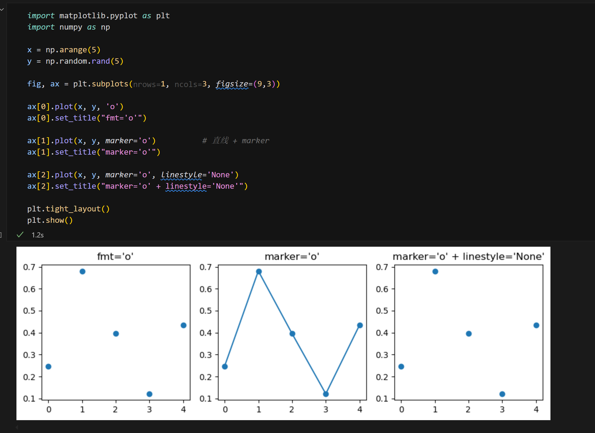
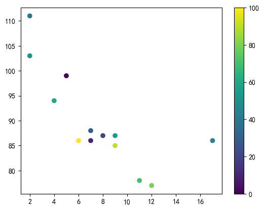

# Pyplot

## 绘制x和y点

`plot()`函数默认从点到点绘制一条直线，参数1是包含x轴上的点的数组，参数2是包含y轴上的点的数组。

比如我们想绘制(1,3)->(8,10)的线，就要传入[1,8]和[3,10]。

如果只想绘制标记点而不绘制直线，可以传入参数`'o'`
`plt.plot(xpoints, ypoints,'o')`

如果我们不指定x轴上的点，它们将获得默认值0,1,2,3,...(取决于y的长度)

## 标记

线段的端点用marker做标记，显式的传入`marker='*'`or`marker='o'`

`plt.plot(xpoints, ypoints,marker='o')` 注意与上述只绘制点的区别

原因：fmt='o' 这个简写字符串已经隐含了
marker='o' 且 linestyle='None'，
所以你看到的是 纯散点。
marker='o' 只设置了 marker，没动 linestyle，
于是默认的 linestyle='-' 仍然有效，
结果 marker 之间被直线连起来了。


格式化字符串传参: `fmt='color|marker|line`

| **分类**          | **字符**                | **效果**                 |
| --------------- | --------------------- | ---------------------- |
| **颜色 (color)**  | `b`                   | blue 蓝色                |
|                 | `g`                   | green 绿色               |
|                 | `r`                   | red 红色                 |
|                 | `c`                   | cyan 青色                |
|                 | `m`                   | magenta 洋红             |
|                 | `y`                   | yellow 黄色              |
|                 | `k`                   | black 黑色               |
|                 | `w`                   | white 白色               |
| **标记 (marker)** | `.`                   | point marker           |
|                 | `,`                   | pixel marker           |
|                 | `o`                   | circle marker          |
|                 | `v`                   | triangle\_down marker  |
|                 | `^`                   | triangle\_up marker    |
|                 | `<`                   | triangle\_left marker  |
|                 | `>`                   | triangle\_right marker |
|                 | `1`                   | tri\_down marker       |
|                 | `2`                   | tri\_up marker         |
|                 | `3`                   | tri\_left marker       |
|                 | `4`                   | tri\_right marker      |
|                 | `s`                   | square marker          |
|                 | `p`                   | pentagon marker        |
|                 | `*`                   | star marker            |
|                 | `h`                   | hexagon1 marker        |
|                 | `H`                   | hexagon2 marker        |
|                 | `+`                   | plus marker            |
|                 | `x`                   | x marker               |
|                 | `D`                   | diamond marker         |
|                 | `d`                   | thin\_diamond marker   |
|                 | `&#124;`              | vertical line marker   |
|                 | `_`                   | horizontal line marker |
| **线型 (line)**   | `-`                   | solid line 实线          |
|                 | `--`                  | dashed line 虚线         |
|                 | `-.`                  | dash-dot line 点划线      |
|                 | `:`                   | dotted line 点线         |
|                 | `None` / `' '` / `''` | 无线段                    |

marker相关参数:

- ms(markersize)
- mec(markeredgecolor): marker边缘颜色
- mfc(markerfacecolor): marker内部颜色

设置中文字体： `matplotlib.rcParams['font.sans-serif'] = ['KaiTi']  `

## 标签

`xlabel()`和`ylabel()`设置横纵坐标的标签

`title()`设置标题

设置字体:

```python

   font1 = {'family':'serif','color':'blue','size':20}
   font2 = {'family':'serif','color':'red','size':50}

   plt.title("运动健康数据",fontdict=font1)
   plt.xlabel("平均脉搏",fontdict=font2)
   plt.ylabel("卡路里消耗量",fontdict=font2)

   plt.plot(x,y)
   plt.show()


```

`loc()`参数表明标题位置 `left,right,center`

## 网格

`plt.grid()` 绘制x,y网格

`plt.grid(axis='x')` 绘制x的网格（平行于y轴）

`color,linestyle,linewidth`

## 多图

在绘制之前设置`plt.subplot(row,col,index)`，row,col表示这个图像一共有row行，col列，当前子图是第index个(0-base)。index计数：从左到右，从上到下。

`title()`为每个子图设置标题

`suptitle()`为整张图片设置标题

## 散点图

`plt.scatter()`

`color=`为整体上色

`colors = ["red","blue","..."]`此时是为每个点上色（按照传入的顺序），注意此时只能用`c=`传参

颜色图： `cmap` + `plt.colorbar()`

比方说使用`viridis`，从0（紫色）到100（黄色）

```python

x=np.array([5,7,8,7,2,17,2,9,4,11,12,9,6])
y=np.array([99,86,87,88,111,86,103,87,94,78,77,85,86])
colors=np.array([0,10,20,30,40,45,50,55,60,70,80,90,100])
plt.scatter(x,y, c=colors, cmap='viridis')
plt.colorbar()
plt.show()

```


`s`: 点的大小

`alpha`: 透明度

## 柱状图

`bar()`绘制垂直柱状图，`width()`条宽

`barh()`绘制水平柱状图，`height()`条高

## 直方图

`hist()`

## 饼图

`pie()`

`labels=`接受标签

`startangle=`起始角度，默认是0，可以是从$[a, b)$中改变

`explode`让其中一个楔子脱颖而出

`shadow=True`添加阴影

`legend()`添加图例
`legend(title="xxx")`