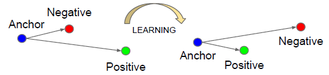
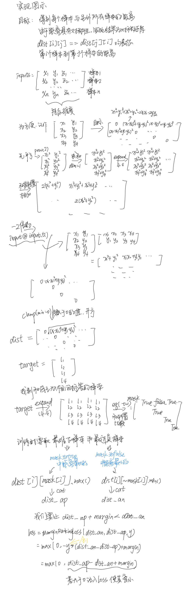

# Triplet Loss



如上图所示，Triplet Loss 是有一个三元组<a, p, n>构成，其中

a: anchor 表示训练样本。

p: positive 表示预测为正样本。

n: negative 表示预测为负样本。

triplet loss的作用：用于减少positive（正样本）与anchor之间的距离，扩大negative（负样本）与anchor之间的距离。基于上述三元组，可以构建一个positive pair <a, p>和一个negative pair <a, n>。triplet loss的目的是在一定距离（margin）上把positive pair和negative pair分开。

所以我们希望：D(a, p) < D(a, n)。进一步希望在一定距离上（margin） 满足这个情况：D(a, p)  + margin  <  D(a, n)

（a）easy triplets：loss = 0，D(a, p) + margin < D(a, n)，positive pair 的距离远远小于于negative pair的距离。即，类内距离很小，类间很大距离，这种情况不需要优化。

（b）hard triplets：D(a, n)   <  D(a, p) ，positive pair 的距离大于于negative pair的距离，即类内距离大于类间距离。这种情况比较难优化。

（c）semi-hard triplets：D(a, p) < D(a, n) < D(a, p) + margin。positive pair的距离和negative pair的距离比较高近。即，<a, p>和<a, n>很近，但都在一个margin内。比较容易优化。

当为 semi-hard triplets 时， D(a, p) + margin -  D(a, n) > 0产生loss.

训练时，早期为了网络loss平稳，一般选择easy triplets进行优化，后期为了优化训练关键是要选择hard triplets。

## 实现原理



## Pytorch源码实现

```python
class TripletLoss(nn.Module):
    """Triplet loss with hard positive/negative mining.
    
    Reference:
        Hermans et al. In Defense of the Triplet Loss for Person Re-Identification. arXiv:1703.07737.
    
    Imported from `<https://github.com/Cysu/open-reid/blob/master/reid/loss/triplet.py>`_.
    
    Args:
        margin (float, optional): margin for triplet. Default is 0.3.
    """
    
    def __init__(self, margin=0.3,global_feat, labels):
        super(TripletLoss, self).__init__()
        self.margin = margin
        self.ranking_loss = nn.MarginRankingLoss(margin=margin)
 
    def forward(self, inputs, targets):
        """
        Args:
            inputs (torch.Tensor): feature matrix with shape (batch_size, feat_dim).
            targets (torch.LongTensor): ground truth labels with shape (num_classes).
        """
        n = inputs.size(0)
        
        # Compute pairwise distance, replace by the official when merged
        dist = torch.pow(inputs, 2).sum(dim=1, keepdim=True).expand(n, n)
        dist = dist + dist.t()
        dist.addmm_(1, -2, inputs, inputs.t())
        dist = dist.clamp(min=1e-12).sqrt()  # for numerical stability
        
        # For each anchor, find the hardest positive and negative
        mask = targets.expand(n, n).eq(targets.expand(n, n).t())
        dist_ap, dist_an = [], []
        for i in range(n):
            dist_ap.append(dist[i][mask[i]].max().unsqueeze(0))
            dist_an.append(dist[i][mask[i] == 0].min().unsqueeze(0))
        dist_ap = torch.cat(dist_ap)
        dist_an = torch.cat(dist_an)
        
        # Compute ranking hinge loss
        y = torch.ones_like(dist_an)
        return self.ranking_loss(dist_an, dist_ap, y)

```

好的！我将通过一个具体的例子，详细解释 `TripletLoss` 的计算过程，包括 **输入数据、距离矩阵计算、难样本挖掘和损失计算** 的每一步。

---

## **1. 输入数据**
假设我们有一个 batch 包含 **4 个样本**，每个样本的特征维度是 **2**（简化计算），并且它们的标签如下：

- **输入特征 `inputs`**（4×2 的张量）：
  ```python
  inputs = torch.tensor([
      [1.0, 2.0],   # 样本 0，标签 1
      [2.0, 3.0],   # 样本 1，标签 1
      [4.0, 5.0],   # 样本 2，标签 2
      [5.0, 6.0]    # 样本 3，标签 2
  ])
  ```
- **标签 `targets`**：
  ```python
  targets = torch.tensor([1, 1, 2, 2])
  ```

---

## **2. 计算所有样本之间的欧氏距离矩阵**
三元组损失的关键是计算 **所有样本对的距离**，得到一个 `4×4` 的距离矩阵 `dist`。

### **(1) 计算 `dist`**
代码：
```python
dist = torch.pow(inputs, 2).sum(dim=1, keepdim=True).expand(n, n)
dist = dist + dist.t()
dist.addmm_(1, -2, inputs, inputs.t())
dist = dist.clamp(min=1e-12).sqrt()
```
**步骤分解：**
1. **计算每个样本的 L2 范数平方**：
   - `torch.pow(inputs, 2)` → 每个元素平方：
     ```
     [[1, 4], [4, 9], [16, 25], [25, 36]]
     ```
   - `.sum(dim=1, keepdim=True)` → 对每行求和（即 `x_i^2 + y_i^2`）：
     ```
     [[5], [13], [41], [61]]
     ```
   - `.expand(4, 4)` → 扩展成 `4×4` 矩阵：
     ```
     [[5, 5, 5, 5],
      [13, 13, 13, 13],
      [41, 41, 41, 41],
      [61, 61, 61, 61]]
     ```

2. **加上其转置矩阵**：
   ```python
   dist = dist + dist.t()
   ```
   - 结果：
     ```
     [[10, 18, 46, 66],
      [18, 26, 54, 74],
      [46, 54, 82, 102],
      [66, 74, 102, 122]]
     ```

3. **计算 `-2 * (inputs @ inputs.T)` 并加到 `dist`**：
   ```python
   dist.addmm_(1, -2, inputs, inputs.t())
   ```
   - `inputs @ inputs.T`（矩阵乘法）：
     ```
     [[5, 8, 14, 17],
      [8, 13, 23, 28],
      [14, 23, 41, 50],
      [17, 28, 50, 61]]
     ```
   - `-2 * (inputs @ inputs.T)`：
     ```
     [[-10, -16, -28, -34],
      [-16, -26, -46, -56],
      [-28, -46, -82, -100],
      [-34, -56, -100, -122]]
     ```
   - 最终 `dist`（`dist += -2 * (inputs @ inputs.T)`）：
     ```
     [[0, 2, 18, 32],
      [2, 0, 8, 18],
      [18, 8, 0, 2],
      [32, 18, 2, 0]]
     ```

4. **数值稳定化 + 开平方**：
   ```python
   dist = dist.clamp(min=1e-12).sqrt()
   ```
   - 由于 `dist` 已经是非负数，开平方后仍然是：
     ```
     [[0.0, 1.414, 4.242, 5.656],
      [1.414, 0.0, 2.828, 4.242],
      [4.242, 2.828, 0.0, 1.414],
      [5.656, 4.242, 1.414, 0.0]]
     ```

✅ **最终 `dist` 矩阵**（`dist[i][j]` = 样本 `i` 和 `j` 的距离）：
|       | 样本 0 | 样本 1 | 样本 2 | 样本 3 |
|-------|-------|-------|-------|-------|
| 样本 0 | 0.0   | 1.414 | 4.242 | 5.656 |
| 样本 1 | 1.414 | 0.0   | 2.828 | 4.242 |
| 样本 2 | 4.242 | 2.828 | 0.0   | 1.414 |
| 样本 3 | 5.656 | 4.242 | 1.414 | 0.0   |

---

## **3. 难样本挖掘（Hard Mining）**
三元组损失的核心是：
- **正样本距离（`dist_ap`）**：与 `anchor` 同类的最远样本（最难正样本）。
- **负样本距离（`dist_an`）**：与 `anchor` 不同类的最近样本（最难负样本）。

### **(1) 构建 `mask` 矩阵**
```python
mask = targets.expand(n, n).eq(targets.expand(n, n).t())
```
- `targets.expand(4, 4)`：
  ```
  [[1, 1, 2, 2],
   [1, 1, 2, 2],
   [2, 2, 2, 2],
   [2, 2, 2, 2]]
  ```
- `targets.expand(4, 4).t()`（转置）：
  ```
  [[1, 1, 2, 2],
   [1, 1, 2, 2],
   [2, 2, 2, 2],
   [2, 2, 2, 2]]
  ```
- `mask`（`True` 表示同类）：
  ```
  [[True, True, False, False],
   [True, True, False, False],
   [False, False, True, True],
   [False, False, True, True]]
  ```

### **(2) 计算 `dist_ap` 和 `dist_an`**
```python
dist_ap, dist_an = [], []
for i in range(n):
    dist_ap.append(dist[i][mask[i]].max().unsqueeze(0))  # 同类最远
    dist_an.append(dist[i][mask[i] == 0].min().unsqueeze(0))  # 不同类最近
```
**逐样本分析：**
1. **样本 0（标签 1）**：
   - `mask[0] = [True, True, False, False]`（同类：样本 0, 1）
   - `dist_ap`：`dist[0][mask[0]] = [0.0, 1.414]` → `max = 1.414`
   - `dist_an`：`dist[0][mask[0]==False] = [4.242, 5.656]` → `min = 4.242`

2. **样本 1（标签 1）**：
   - `mask[1] = [True, True, False, False]`（同类：样本 0, 1）
   - `dist_ap`：`dist[1][mask[1]] = [1.414, 0.0]` → `max = 1.414`
   - `dist_an`：`dist[1][mask[1]==False] = [2.828, 4.242]` → `min = 2.828`

3. **样本 2（标签 2）**：
   - `mask[2] = [False, False, True, True]`（同类：样本 2, 3）
   - `dist_ap`：`dist[2][mask[2]] = [0.0, 1.414]` → `max = 1.414`
   - `dist_an`：`dist[2][mask[2]==False] = [4.242, 2.828]` → `min = 2.828`

4. **样本 3（标签 2）**：
   - `mask[3] = [False, False, True, True]`（同类：样本 2, 3）
   - `dist_ap`：`dist[3][mask[3]] = [1.414, 0.0]` → `max = 1.414`
   - `dist_an`：`dist[3][mask[3]==False] = [5.656, 4.242]` → `min = 4.242`

✅ **最终 `dist_ap` 和 `dist_an`**：
```python
dist_ap = [1.414, 1.414, 1.414, 1.414]
dist_an = [4.242, 2.828, 2.828, 4.242]
```

---

## **4. 计算 Triplet Loss**
代码：
```python
y = torch.ones_like(dist_an)
loss = self.ranking_loss(dist_an, dist_ap, y)
```
- `y = [1, 1, 1, 1]`（我们希望 `dist_an > dist_ap`）
- `MarginRankingLoss` 公式：
  ```
  loss = max(0, -y * (dist_an - dist_ap) + margin)
        = max(0, dist_ap - dist_an + margin)
  ```
- 计算每个样本的损失：
  - 样本 0：`max(0, 1.414 - 4.242 + 0.3) = max(0, -2.528) = 0`
  - 样本 1：`max(0, 1.414 - 2.828 + 0.3) = max(0, -1.114) = 0`
  - 样本 2：`max(0, 1.414 - 2.828 + 0.3) = max(0, -1.114) = 0`
  - 样本 3：`max(0, 1.414 - 4.242 + 0.3) = max(0, -2.528) = 0`
- **最终 loss**：`(0 + 0 + 0 + 0) / 4 = 0`

✅ **结论**：
- 由于 `dist_an` 已经比 `dist_ap` 大很多（满足 `dist_an > dist_ap + margin`），所以损失为 0。
- 如果 `dist_an` 不够大，损失会惩罚模型，使其拉近正样本、推远负样本。

---

## **总结**
1. **计算所有样本对的距离矩阵 `dist`**（欧氏距离）。
2. **难样本挖掘**：
   - `dist_ap`：同类最远样本（最难正样本）。
   - `dist_an`：不同类最近样本（最难负样本）。
3. **计算 Triplet Loss**：
   - 如果 `dist_an` 不比 `dist_ap` 大至少 `margin`，则产生损失。

这样，模型会学习让 **同类样本更接近，不同类样本更远离**，从而提升特征判别性。