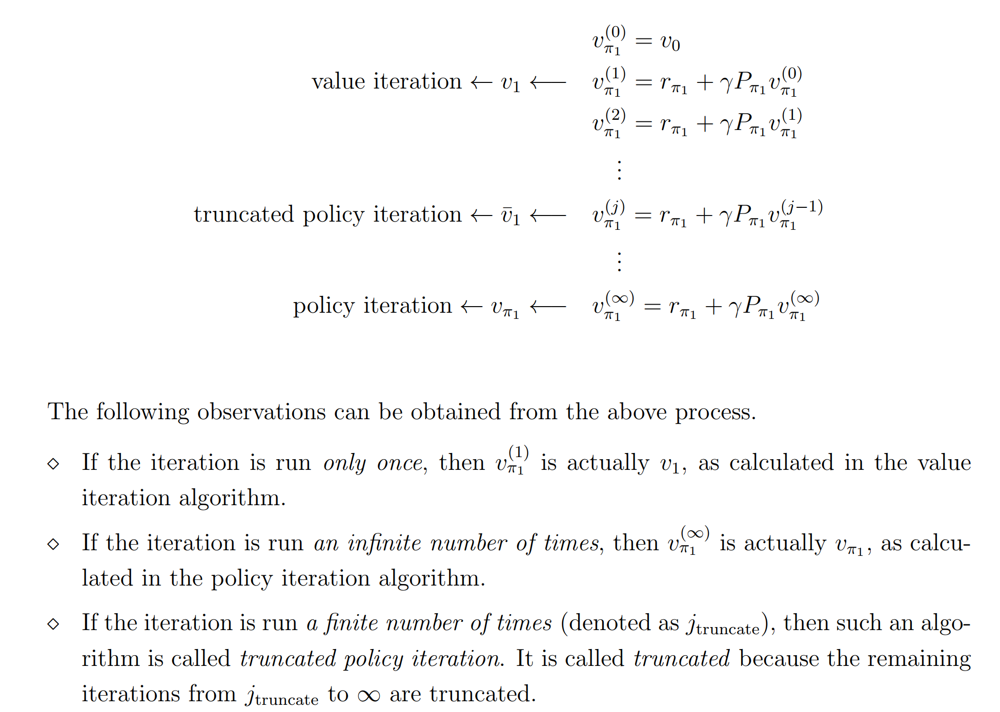
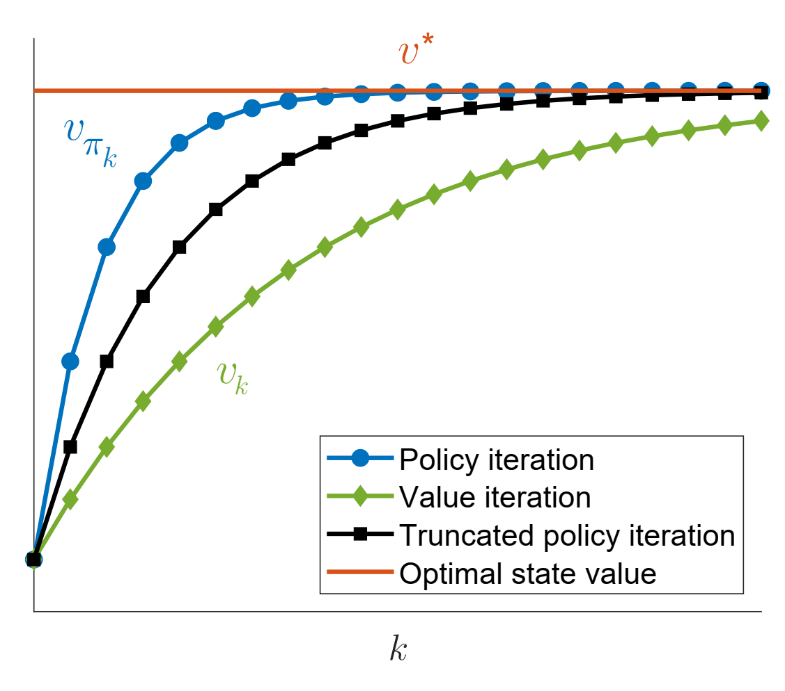

# 值迭代算法核心基础

1. **算法来源**：基于第3课的 **贝尔曼最优公式**，通过 “压缩映射定理（Contraction Mapping Theorem）” 可证明：按值迭代算法迭代即可收敛到最优策略与最优状态值（Optimal State Value）。

2. **关键概念澄清**：迭代过程中的 $$v_k$$ 并非“状态值（State Value）”，而是一个可任意初始化的 **向量/数值**，仅用于逐步逼近最优值，这也是“值迭代”名称的由来。

## 值迭代算法核心步骤（含数学形式与实现逻辑）

值迭代算法分为 “策略更新 (Policy Update)” 和 “值更新 (Value Update)” 两步，可用“元素形式（编程实现）”来理解：

### 1. 两步核心流程

| 步骤 | 目标 | 数学逻辑（元素形式） | 实现关键操作 |
| ---- | ---- | -------------------- | ------------ |
| 策略更新 | 基于当前 $$v_k$$ 找到贪婪策略 $$\pi_{k+1}$$ | 对每个状态 $$s$$ 计算所有动作 $$a$$ 的 Q 值：$$ q_k(s,a) = r(s,a) + \gamma \sum_{s'} P(s'\mid s,a)\, v_k(s') $$ 选取最大值动作 $$a^*$$ | 1. 遍历所有状态；2. 计算 $$q_k(s,a)$$；3. 取最大值形成确定性策略 |
| 值更新 | 基于 $$\pi_{k+1}$$ 计算新值 $$v_{k+1}$$ | $$ v_{k+1}(s) = \max_a q_k(s,a) $$ | 复用 $$q_k(s,a)$$ 取最大值作为 $$v_{k+1}(s)$$ |

### 2. 算法终止条件

若 $$\lVert v_{k+1} - v_k \rVert < \epsilon$$（如 $$\epsilon=10^{-3}$$）视为收敛，对应策略即为最优策略。

## 值迭代算法伪代码（可执行框架）

1. 初始化：任意设置初始值向量 $$v_0$$（如全 0），设阈值 $$\epsilon$$。
2. 循环（直到收敛）：对每个状态 $$s$$：
   1. 计算每个动作：$$ q(s,a) = r(s,a) + \gamma \sum_{s'} P(s'\mid s,a)\, v_k(s') $$
   2. 策略更新：取使 $$q(s,a)$$ 最大的动作 $$a^*$$，令 $$\pi_{k+1}(s)=a^*$$
   3. 值更新：$$ v_{k+1}(s) = \max_a q(s,a) $$
3. 收敛判定：若所有状态 $$|v_{k+1}(s) - v_k(s)| < \epsilon$$ 停止；否则 $$v_k \leftarrow v_{k+1}$$。
4. 输出：最优策略 $$\pi^* = \pi_{k+1}$$，最优值 $$v^* = v_{k+1}$$。

## 实例演示（网格世界）

以含 Forbidden Area 与 Target Area 的网格世界为例：

1. 初始化（$$k=0$$）：设 $$v_0=0$$，计算所有 $$q_0(s,a)$$，得到初始贪婪策略与 $$v_1 = \max_a q_0(s,a)$$。
2. 第一次迭代（$$k=1$$）：用 $$v_1$$ 计算 $$q_1(s,a)$$，策略更新后全部状态最优，$$v_2$$ 收敛。
3. 结论：简单问题 2–3 轮即可收敛；复杂问题需更多迭代，只要终止条件满足即可得到最优解。

## 编程实现提示

1. Q 值无需显式存整张表，只需按需计算：$$ q(s,a)= r(s,a)+\gamma \sum_{s'} P(s'\mid s,a) v_k(s') $$。
2. 多个动作并列最优时可随机选一个，不影响收敛。
3. 实践常用：若所有状态 $$|v_{k+1}(s)-v_k(s)|<\epsilon$$ 则停止。

---

# 第4课 - 值迭代与策略迭代（策略迭代算法）知识点整理

## 一、课程定位与算法关联

1. **知识承接**：策略迭代（Policy Iteration）是强化学习中 **Model-Based** 核心算法，上承贝尔曼方程（策略评估），下接“截断策略迭代”，也是蒙特卡洛方法的基础。
2. **与值迭代的关系**：策略迭代与值迭代是“截断策略迭代”的两个端点——策略迭代的“策略评估”迭代至收敛；值迭代只做 1 步评估。差别是对评估精度的取舍。

## 二、策略迭代算法核心框架

### 1. 核心循环逻辑

$$ \pi_0 \;\xrightarrow{\text{评估}}\; v^{\pi_0} \;\xrightarrow{\text{改进}}\; \pi_1 \;\xrightarrow{\text{评估}}\; v^{\pi_1} \;\xrightarrow{\text{改进}}\; \pi_2 \; \cdots \;\longrightarrow \pi^* $$

### 2. 两大核心步骤

| 步骤 | 目标 | 元素级数学形式 | 核心操作 |
| ---- | ---- | --------------- | -------- |
| 策略评估 (PE) | 给定 $$\pi_k$$ 求 $$v^{\pi_k}$$ | $$ v^{\pi_k}(s)=\sum_a \pi_k(a\mid s)\Big[r(s,a)+\gamma\sum_{s'} P(s'\mid s,a)v^{\pi_k}(s')\Big] $$ | 迭代直到值向量变化 < 阈值 |
| 策略改进 (PI) | 基于 $$v^{\pi_k}$$ 得到更优 $$\pi_{k+1}$$ | $$ \pi_{k+1}(s)=\operatorname*{argmax}_a\Big[r(s,a)+\gamma\sum_{s'}P(s'\mid s,a)v^{\pi_k}(s')\Big] $$ | 计算所有 $$q^{\pi_k}(s,a)$$ 取最大动作 |

## 三、关键问题解答

### 1. 策略评估的两种方法

- 解析解：矩阵形式 $$ v = (I-\gamma P^{\pi})^{-1} R^{\pi} $$（状态多时不实用）。
- 迭代解：从 $$v^{(0)}$$ 出发：
  $$ v^{(j+1)}(s)=\sum_a \pi_k(a\mid s)\Big[r(s,a)+\gamma\sum_{s'}P(s'\mid s,a) v^{(j)}(s')\Big] $$
  直到 $$\max_s |v^{(j+1)}(s)-v^{(j)}(s)|<\epsilon$$。

### 2. 为什么改进后更优？

策略改进定理：基于 $$v^{\pi_k}$$ 生成的贪婪策略 $$\pi_{k+1}$$ 满足
$$ v^{\pi_{k+1}}(s) \ge v^{\pi_k}(s),\;\forall s $$
且至少一处严格大于，因此收益不劣。

> [!info]### Lemma 4.1 (Policy improvement)
> If $\pi_{k+1} = \arg\max_\pi (r_\pi + \gamma P_\pi v_{\pi_k})$, then $v_{\pi_{k+1}} \geq v_{\pi_k}$.
>
> Here, $v_{\pi_{k+1}} \geq v_{\pi_k}$ means that $v_{\pi_{k+1}}(s) \geq v_{\pi_k}(s)$ for all $s$. The proof of this lemma is given in Box 4.1.
>
> ## Proof of Lemma 4.1
>
> Since $v_{\pi_{k+1}}$ and $v_{\pi_k}$ are state values, they satisfy the Bellman equations:
>
> $$v_{\pi_{k+1}} = r_{\pi_{k+1}} + \gamma P_{\pi_{k+1}} v_{\pi_{k+1}},$$
>
> $$v_{\pi_k} = r_{\pi_k} + \gamma P_{\pi_k} v_{\pi_k}.$$
>
> Since $\pi_{k+1} = \arg\max_\pi (r_\pi + \gamma P_\pi v_{\pi_k})$, we know that
>
> $$r_{\pi_{k+1}} + \gamma P_{\pi_{k+1}} v_{\pi_k} \geq r_{\pi_k} + \gamma P_{\pi_k} v_{\pi_k}.$$
>
> It then follows that
>
> $$
> \begin{align*}
> v_{\pi_k} - v_{\pi_{k+1}} &= (r_{\pi_k} + \gamma P_{\pi_k} v_{\pi_k}) - (r_{\pi_{k+1}} + \gamma P_{\pi_{k+1}} v_{\pi_{k+1}}) \\
> &\leq (r_{\pi_{k+1}} + \gamma P_{\pi_{k+1}} v_{\pi_k}) - (r_{\pi_{k+1}} + \gamma P_{\pi_{k+1}} v_{\pi_{k+1}}) \\
> &\leq \gamma P_{\pi_{k+1}} (v_{\pi_k} - v_{\pi_{k+1}}).
> \end{align*}
> $$
>
> Therefore,
>
> $$
> \begin{align*}
> v_{\pi_k} - v_{\pi_{k+1}} &\leq \gamma^2 P_{\pi_{k+1}}^2 (v_{\pi_k} - v_{\pi_{k+1}}) \leq \dots \leq \gamma^n P_{\pi_{k+1}}^n (v_{\pi_k} - v_{\pi_{k+1}}) \\
> &\leq \lim_{n \to \infty} \gamma^n P_{\pi_{k+1}}^n (v_{\pi_k} - v_{\pi_{k+1}}) = 0.
> \end{align*}
> $$
>
> The limit is due to the facts that $\gamma^n \to 0$ as $n \to \infty$ and $P_{\pi_{k+1}}^n$ is a nonnegative stochastic matrix for any $n$. Here, a stochastic matrix refers to a nonnegative matrix whose row sums are equal to one for all rows.

### 3. 收敛性

1. 单调：$$ v^{\pi_k} $$ 单调不减且有上界 $$v^*$$。
2. 折扣：$$ \gamma\in[0,1) $$ 确保回报有界，最终 $$ v^{\pi_k} \to v^* $$，对应策略即 $$\pi^*$$。

> [!info] 
>
> Theorem 4.1 (Convergence of policy iteration). **The state value sequence $\{v_{\pi_k}\}^\infty_{k=0}$ generated by the policy iteration algorithm converges to the optimal state value $v^∗$. As a result, the policy sequence $\{\pi_k\}_{k=0}^\infty$ converges to an optimal policy.**  
>
> ## Proof of Theorem 4.1
>
> The idea of the proof is to show that the policy iteration algorithm converges faster than the value iteration algorithm.
>
> In particular, to prove the convergence of $\{v_{\pi_k}\}_{k=0}^\infty$, we introduce another sequence $\{v_k\}_{k=0}^\infty$ generated by
> $$v_{k+1} = f(v_k) = \max_\pi (r_\pi + \gamma P_\pi v_k).$$
> This iterative algorithm is exactly the value iteration algorithm. We already know that $v_k$ converges to $v^*$ when given any initial value $v_0$.
>
> For $k=0$, we can always find a $v_0$ such that $v_{\pi_0} \geq v_0$ for any $\pi_0$.
>
> We next show that $v_k \leq v_{\pi_k} \leq v^*$ for all $k$ by induction.
>
> For $k \geq 0$, suppose that $v_{\pi_k} \geq v_k$.
>
> For $k+1$, we have
> $$
> \begin{align*}
> v_{\pi_{k+1}} - v_{k+1} &= (r_{\pi_{k+1}} + \gamma P_{\pi_{k+1}} v_{\pi_{k+1}}) - \max_\pi (r_\pi + \gamma P_\pi v_k) \\
> &\geq (r_{\pi_{k+1}} + \gamma P_{\pi_{k+1}} v_{\pi_k}) - \max_\pi (r_\pi + \gamma P_\pi v_k) \quad \text{(because $v_{\pi_{k+1}} \geq v_{\pi_k}$ by Lemma 4.1 and $P_{\pi_{k+1}} \geq 0$)} \\
> &= (r_{\pi_{k+1}} + \gamma P_{\pi_{k+1}} v_{\pi_k}) - (r_{\pi_k'} + \gamma P_{\pi_k'} v_k) \quad \text{(suppose $\pi_k' = \arg\max_\pi (r_\pi + \gamma P_\pi v_k)$)} \\
> &\geq (r_{\pi_k'} + \gamma P_{\pi_k'} v_{\pi_k}) - (r_{\pi_k'} + \gamma P_{\pi_k'} v_k) \quad \text{(because $\pi_{k+1} = \arg\max_\pi (r_\pi + \gamma P_\pi v_{\pi_k})$)} \\
> &= \gamma P_{\pi_k'} (v_{\pi_k} - v_k).
> \end{align*}
> $$
>
> Since $v_{\pi_k} - v_k \geq 0$ and $P_{\pi_k'}$ is nonnegative, we have $P_{\pi_k'} (v_{\pi_k} - v_k) \geq 0$ and hence $v_{\pi_{k+1}} - v_{k+1} \geq 0$.
>
> Therefore, we can show by induction that $v_k \leq v_{\pi_k} \leq v^*$ for any $k \geq 0$. Since $v_k$ converges to $v^*$, $v_{\pi_k}$ also converges to $v^*$.

## 四、策略迭代伪代码

1. 初始化：随机策略 $$\pi_0$$，折扣 $$\gamma$$，阈值 $$\epsilon$$。
2. 循环直到策略稳定：
   1. 策略评估：求解Bellman公式，这里使用迭代求 $v_{\pi_k}$：
      $$ v^{(j+1)}(s)=\sum_a \pi_k(a\mid s)\Big[r(s,a)+\gamma\sum_{s'}P(s'\mid s,a)v^{(j)}(s')\Big] $$
      若 $$\max_s |v^{(j+1)}(s)-v^{(j)}(s)|<\epsilon$$ 停止，令 $$v_{\pi_k}=v^{(j+1)}$$。
   2. 策略改进：对每个 $$s$$：
      $$ q_{\pi_k}(s,a)=r(s,a)+\gamma\sum_{s'}P(s'\mid s,a)v_{\pi_k}(s') $$
      取最大动作得 $$\pi_{k+1}(s)$$。
   3. 若 $$\pi_{k+1}=\pi_k$$ 停止；否则 $$\pi_k\leftarrow\pi_{k+1}$$。
3. 输出： $$\pi^*=\pi_{k+1},\; v^*=v_{\pi_{k+1}}$$。

## 五、实例

### 1. 2 格网格

- 状态：$$s_1,s_2$$（$$s_2$$ 为目标）。
- 动作：左、停、右。
- 奖励：$$ r(s_2,\cdot)=1 $$ 其余 $$ -1 $$。
- 初始策略 $$\pi_0$$：总是左。
- 评估得：长期陷入 $$s_1$$ 回报极低，$$ v^{\pi_0}(s_2)=1 $$。
- 改进：在 $$s_1$$ 右移动作价值最大，得 $$\pi_1(s_1)=\text{右}$$，$$\pi_1(s_2)=\text{停}$$，收敛。

### 2. 5×5 网格（含禁止区）

- 现象：靠近目标的状态先优化。
- 原因：这些状态的值先接近最优，使其相邻状态的 $$q$$ 估计更准确，推动外层扩散。

## 六、实现注意事项

1. 策略评估不必极度精确，可用较宽松 $$\epsilon$$（如 0.1）加速，后续迭代会修正。
2. 多最优动作可随机选或平均分配；最终仍收敛到同一 $$\pi^*$$。
3. 需准备高效结构存储 $$P(s'\mid s,a)$$ 与 $$r(s,a)$$ 以便计算 $$q(s,a)$$。

---

# 第4课-值迭代与策略迭代（截断策略迭代算法）知识点整理

## 一、核心算法关系框架

截断策略迭代（Truncated Policy Iteration）并非独立算法，而是**值迭代（Value Iteration）与策略迭代（Policy Iteration）的一般化推广**，后两者是截断策略迭代的“极端特殊情况”：
- 当截断迭代步数（j）=1时，截断策略迭代退化为值迭代；
- 当截断迭代步数（j）=$\infty$时，截断策略迭代退化为策略迭代。

## 二、三大算法核心流程对比
### 1. 策略迭代（Policy Iteration）
#### 核心逻辑
从**初始策略$\pi_0$**（可任意设定，无需最优）出发，通过“策略评估→策略改进”的循环迭代，逐步逼近最优策略与最优状态值（$v^*$）。
#### 关键步骤（第k轮迭代）
1. **策略评估（Policy Evaluation）**：针对当前策略$\pi_k$，求解贝尔曼方程得到其对应的状态值$v_{\pi_k}$（需通过**内嵌无穷次迭代**收敛到精确解$v_{\pi_k}$）；
   - 数学逻辑：$v_{\pi_k}(s) = \mathbb{E}[R_{k+1} + \gamma v_{\pi_k}(S_{k+1}) | S_k=s, \pi_k]$（s为所有状态）；
   - 迭代过程：从任意初始值$v_{\pi_k}(0)$出发，反复更新$v_{\pi_k}(j+1) = \mathbb{E}[R_{k+1} + \gamma v_{\pi_k}(j)(S_{k+1}) | S_k=s, \pi_k]$，直至$v_{\pi_k}(j)$收敛到$v_{\pi_k}$。
2. **策略改进（Policy Improvement）**：基于得到的$v_{\pi_k}$，通过贪心优化更新策略$\pi_{k+1}$：
   - 数学逻辑：$\pi_{k+1}(s) = \arg\max_a \mathbb{E}[R_{k+1} + \gamma v_{\pi_k}(S_{k+1}) | S_k=s, A_k=a]$（对每个状态s选择最优动作a）。
#### 特点
- 理论上需“无穷次内嵌迭代”完成策略评估，**精度高但计算成本极高**；
- 实际工程中无法实现（无法计算无穷步），需通过截断迭代近似。

### 2. 值迭代（Value Iteration）
#### 核心逻辑
从**初始状态值$v_0$**（可任意设定）出发，通过“策略更新→值更新”的简化循环，直接逼近最优状态值$v^*$，再推导最优策略。
#### 关键步骤（第k轮迭代）
1. **策略更新（Policy Update）**：基于当前状态值$v_k$，贪心生成临时策略$\pi_{k+1}$：
   - 数学逻辑：$\pi_{k+1}(s) = \arg\max_a \mathbb{E}[R_{k+1} + \gamma v_k(S_{k+1}) | S_k=s, A_k=a]$；
2. **值更新（Value Update）**：仅通过**1步迭代**更新状态值$v_{k+1}$（无需收敛到$v_{\pi_{k+1}}$）：
   - 数学逻辑：$v_{k+1}(s) = \mathbb{E}[R_{k+1} + \gamma v_k(S_{k+1}) | S_k=s, \pi_{k+1}]$。
#### 特点
- 策略评估仅1步，**计算成本低但单轮精度较低**；
- 无需显式维护策略，通过值迭代直接逼近$v^*$，最终由$v^*$推导最优策略。

### 3. 截断策略迭代（Truncated Policy Iteration）
#### 核心逻辑

解决前两种算法的极端性：在策略评估阶段引入**有限截断步数j**（可自定义，如j=2、10、100），平衡精度与计算成本。
#### 关键步骤（第k轮迭代）
1. **策略评估（截断版）**：针对当前策略$\pi_k$，从初始值$v_{k-1}$（继承自上一轮迭代结果）出发，仅执行**j步内嵌迭代**，得到近似状态值$v_{\pi_k}(j)$（而非无穷步收敛的$v_{\pi_k}$）；
2. **策略改进**：基于近似值$v_{\pi_k}(j)$，贪心更新策略$\pi_{k+1}$，逻辑与策略迭代一致；
3. **迭代终止**：当截断步数j达到预设阈值时，停止当前轮策略评估，进入下一轮循环。

#### 伪代码核心差异
与策略迭代伪代码结构一致，仅将“策略评估的收敛判断”替换为“截断步数计数判断”：
- 策略迭代：while $v_{\pi_k}(j)$未收敛 → 继续迭代；
- 截断策略迭代：for j in 1 to 预设步数 → 执行j步后停止。

## 三、三大算法关键差异与核心结论
### 1. 核心差异：策略评估的迭代步数
| 算法         | 策略评估迭代步数 | 状态值精度                  | 计算成本         | 工程实用性       |
| ------------ | ---------------- | --------------------------- | ---------------- | ---------------- |
| 策略迭代     | $\infty$（理论） | 最高（精确$v_{\pi_k}$）     | 极高（不可实现） | 仅理论参考       |
| 值迭代       | 1                | 较低（近似$v_{\pi_{k+1}}$） | 极低             | 适合快速迭代场景 |
| 截断策略迭代 | 自定义j（有限）  | 中等（$v_{\pi_k}(j)$）      | 中等（可控）     | 实际工程首选     |

### 2. 收敛性保障
- **理论依据**：若策略评估的初始值为$v_{\pi_{k-1}}$（上一轮策略的状态值），则内嵌迭代的状态值$v_{\pi_k}(j)$满足“单调递增”特性（$v_{\pi_k}(j+1) \geq v_{\pi_k}(j)$），且最终收敛到$v_{\pi_k}$；
- **直观表现**：如视频中收敛曲线图所示：
  - 横轴：外循环迭代轮次k；
  - 纵轴：状态值大小；
  - 红线：最优状态值$v^*$；
  - 紫线（值迭代）：从初始值出发，每轮1步更新，逐步逼近$v^*$；
  - 蓝线（策略迭代）：每轮无穷步更新，精度更高但迭代更慢；
  - 黑线（截断策略迭代）：介于两者之间，精度优于值迭代、速度优于策略迭代，最终同样收敛到$v^*$。
  
  
