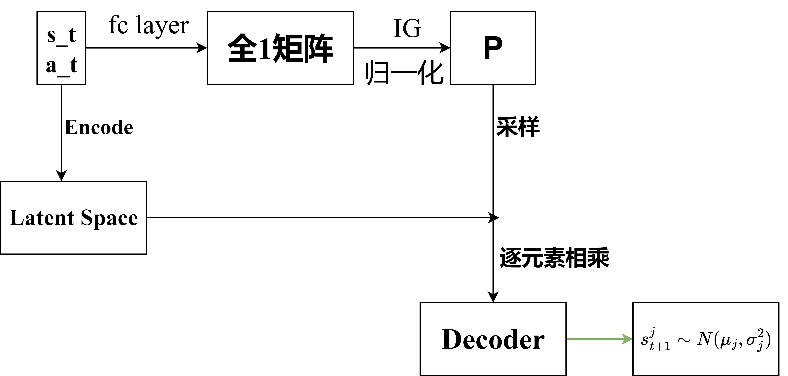
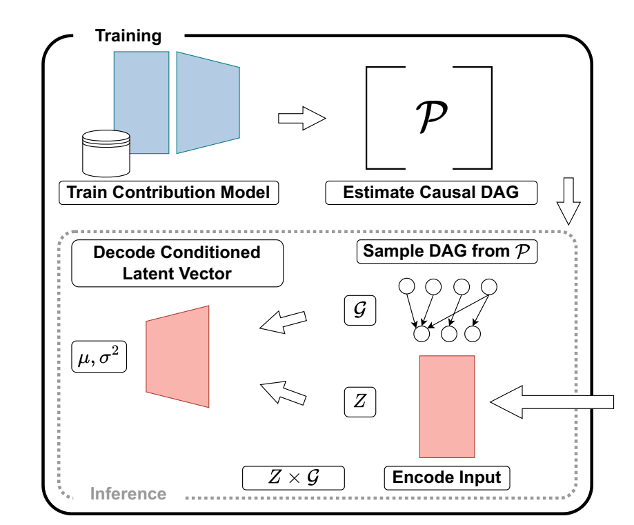
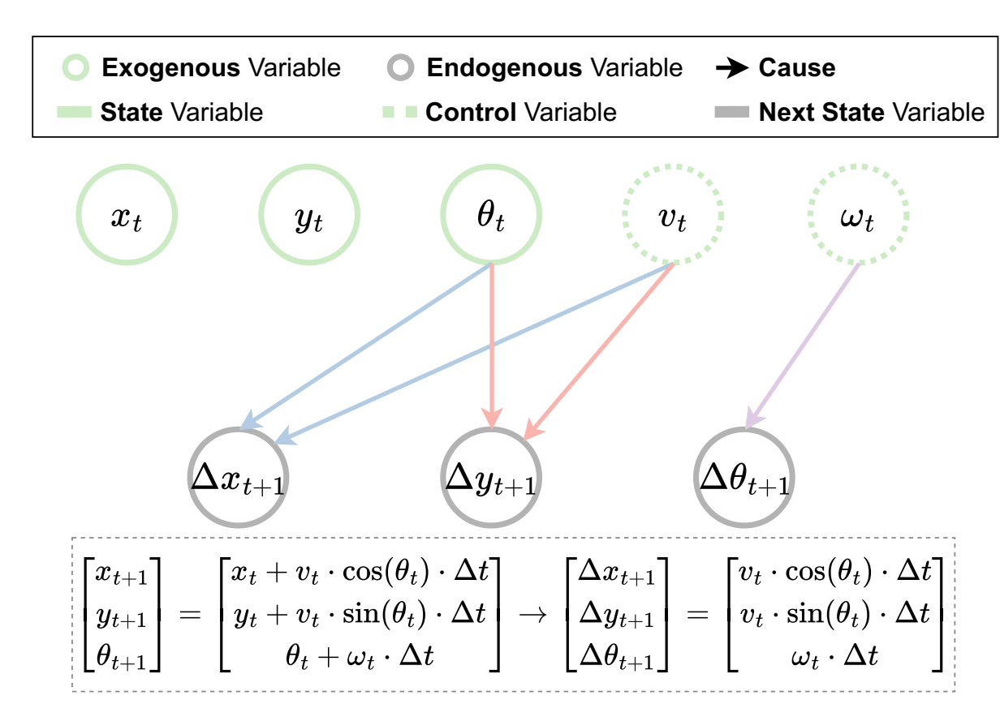

# Leaning Causal Structure Distributions for Robust Planning

## Abstract

Core Idea: Learning a distribution of causal structure rather than a single causal graph,which can profoundly reduce the computation cost and make planning robust.

## Model Architecture

## Supplementary Knowledge

Integrated Gradients for Feature Attribution

Feature Attribution involves determining how each element of the input of a deep neural network contributed to its final prediction.

IG takes two inputs. The first one, x, is the value for which we want to carry out FA. The second one, x′, which we called the null input, is used as a reference input with respect to which FA takes place. Specifically, the null input x′ is chosen so that whenever it is fed to a model M the output from the model is approximately zero.   Usually,We’ll take x’ as zero vector.

IG produces an attribution vector a ∈ $R^D$, defined as IG(x, x′; M) = a where each element $a_i$ of a quantifies the contribution of the i-th feature in the input x to the prediction made by the model M.   

## Methods

### Modeling the SCM Distribution

We take the Markov Chain as DAG. Specifically,we have state variables and action variables of the current time state t,and we have the state variables of the next timestep. The arrows can only flow from exogenous variables(that is state and action) to endogenous variables(state).

If there are n state variables and p action variables, we have an $(n+p) \times n$ matrix,where position i,j represents the causal relation from i to j.
$$
E_{i,j} = \left\{
\begin{array}{ll}
1 & \text{if there exists an edge from row i to column j }  \\
0 & \text{o.w. }
\end{array}
\right.
$$
Each $E_{i,j}$ follows a Bernoulli distribution with parameter $p_{i,j}$. Thus , the probability mass function(PMF) can be given by:

$Pr(E_{i,j}=e_{i,j}) = p_{ij}^{e_{ij}}(1-p_{ij})^{1-e_{ij}},\text{for } e_{i,j} \in \set{0,1}$

Since the existence of an edge from one node to another is independent from other non-related variables, the joint PMF:

$Pr(\set{E_{i,j}=e_{i,j}},\textbf{p}) = \prod_{i,j}p_{ij}^{e_{i,j}}(1-p_{ij})^{1-e_{ij}}$ where $\textbf{p}=(p_{ij})$ is the matrix of Bernoulli parameters.

### Estimating the SCM Distribution Parameters p

Although IG was not designed as a causality test, we use it to estimate the likelihood of each feature being a cause in the underlying SCM, as comparing against a null input x′ (which is the key in the IG method) involves implicitly “assign(ing) blame to a certain cause” . That is, causal influence can be measured from the effect of “perturbing”(intervening) a parent on its child while holding others fixed. IG’s construction—integrating gradients from a null input—provides an efficient approximation of that effect without resorting to combinatorial graph search.  

Using IG, we construct the $(n+p)\times n$ matrix $\textbf{p}$ . We estimate each element as:

$ 
p_{ij} := \text{IG}_{ij}(\mathbf{x}, \mathbf{x}'; \mathcal{M}) 
\\
= (x_i - x'_i) \cdot \int_{\alpha=0}^{1} \frac{\partial}{\partial x_i} \mathcal{M}(\mathbf{x}' + \alpha \times (\mathbf{x} - \mathbf{x}'))_j \, d\alpha,
$ where we set the null input x’ = 0

We then interpret each pij as a score proportional to the (unnormalized) probability that feature $x_t^i \or a_t^i$ is as a cause  of the output $x_{t+1}^j$.Concretely, we normalize across all candidate parents to obtain the Bernoulli parameters $\textbf{p} = (p_{ij})$ for the distribution $\mathcal{P}$:

$
p_{ij} = \max \left( \rho_{min}, \min \left( \frac{\mathbf{s}(|p_{i,j}|)}{\max_j \mathbf{s}(|p_{:,j}|)}, 1 - \rho_{min} \right) \right)
$  

$s(·)$ is an smoothing function to avoid one contribution from significantly out-weighting the others and 0 < $ρ_{min}$ < 0.5 clips the minimum and maximum probability.

### Probabilistic Neural Network

$$ f^D := f(\mathbf{x}) = f_{\text{dec}}(f_{\text{enc}}(\mathbf{x}) \odot \mathbf{M}), \quad \mathbf{M} \sim \mathcal{P}(\mathbf{p}) $$

which encompasses:
- **Encoder:** Let \( $\mathbf{s} \in \mathbb{R}^n$ \) be the vector of state variables and \( $\mathbf{a} \in \mathbb{R}^p$ \) be the vector of action variables. Define the concatenated input vector: \( $$\mathbf{x} = [\mathbf{s}; \mathbf{a}] \in \mathbb{R}^{n+p}$$ \). The encoder \( $f_{\text{enc}}: \mathbb{R}^{n+p} \rightarrow \mathbb{R}^{n+p}$ \) maps this input into a latent space of the same dimension: \( $\mathbf{z} = f_{\text{enc}}(\mathbf{x}) \in \mathbb{R}^{n+p} $ ).
- **Latent Vector Masking:** Let \( $\mathbf{M} \in \{0,1\}^{(n+p) \times n} $\) be the mask matrix sampled from the learned distribution \( $\mathcal{P}$ \). Each element \( $M_{ij}$ \) indicates the presence or absence of an edge from the \( i \)-th latent feature to the \( j \)-th next state variable. Define the masking process as:
  $\mathbf{z}_j = \mathbf{z} \odot \mathbf{m}_{:,j} \quad \text{for } j = 1, 2, \ldots, n,$
  where \( $\mathbf{m}_{:,j}$ \) is the \( j \)-th column of \( $\mathbf{M}$ \) and \( $\odot$ \) denotes element-wise multiplication. By masking we select the latent features to use for predicting each next state variable. Note that \( $\mathbf{M} \sim \mathcal{P}(\mathbf{p})$ \) is sampled every time \( $f(\cdot)$ \) is called.
- **Decoder:** Each masked vector \( $\mathbf{z}_j$ \) is fed to the corresponding decoder \( $f_{\text{dec}}^j: \mathbb{R}^{n+p} \rightarrow \mathbb{R}^2$ \), which outputs the parameters of a Gaussian distribution for the next state variable: \( $(\mu_j, \sigma_j^2) = f_{\text{dec}}^j(\mathbf{z}_j)$ \). The next state variable \( $s'_j $\) is then: \( $s'_j \sim \mathcal{N}(\mu_j, \sigma_j^2)$ \). This way we account for the aleatoric uncertainty due to unexpected and un-modeled disturbances into the prediction.

**Training & Inference. **

During learning we instantiate two models : one for causally-informed dynamics prediction, denoted as $f^D$, and another, the contribution model $f^C$, which will be used to estimate the distribution $\mathcal{P}$($\textbf{p}^D$), from which $f^D$ samples causal masks. By connecting every input feature $x_i$ to every hidden neuron (and ultimately every output ${x_{t+1}^j}$, $f^C$ ensures that no potential causal link is precluded by architectural sparsity. This “fully wired" design is essential: if we omitted any connection in $f^C$, we could not attribute an input–output pair, biasing the learned causalstructure distribution. Specifically, for $f^C$, we constrain all elements of the parameter vector $\textbf{p}^C$ to one, i.e.: $p_{ij}^C = 1$ , ∀i, j. 

This configuration ensures that all input variables to $f^C$ remain active during latent vector masking, thereby simulating a scenario in which all inputs are treated as causes of all output variables.

The training procedure follows a sequential approach. First, we train $f^C$ using the available dataset D. Once trained, we employ $f^C$ as the model IG will use to compute an estimate of $p^D$  and subsequently transforming each element $pij ∈ p^D$ . The resulting parameter vector $p^D$ then defines the distribution from which the causal masks M are sampled during the training of $f^D$ with the data in D.

At inference time, $f^C$ is discarded, and the final learned value of $p^D$ is employed to parameterize the causal mask distribution P($p^D$), ensuring that the causal relationships inferred during training are preserved in deployment. 

### Symbol Analysis

---

1️⃣ \( f^C \)（Contribution Model）

- **定义**：  
  \( f^C \) 是一个全连接的神经网络，用于估计训练时输入变量（当前状态 \( s_t \) 和控制输入 \( a_t \)）对输出变量（下一状态 \( s_{t+1} \)）的因果贡献。
- **作用**：  
  - **无偏估计因果贡献**：通过全连接的设计，确保每个输入变量都有机会对每个输出变量产生影响，避免遗漏任何潜在的因果关系。
- **结构**：  
  - 输入：当前状态 \( s_t \) 和控制输入 \( a_t \) 的拼接 \([s_t; a_t]\)。
  - 输出：一个概率矩阵 \( p^C \)，其中每个元素 \( p^C_{ij} \) 表示从输入变量 \( i \) 到输出变量 \( j \) 的因果边存在的概率。
- **训练**：  
  - 使用完整的数据集训练 \( f^C \)，确保所有可能的因果路径都被考虑。
  - 训练完成后，\( f^C \)被抛弃。

2️⃣ \( p^C \)

- **定义**：  
  \( p^C \) 是一个概率矩阵，表示从输入变量到输出变量的因果边存在的概率。

- **作用**：  
  - **无偏估计**：在训练 \( f^C \) 时，\( p^C \) 的所有元素都被设置为 1，确保所有输入变量都参与对每个输出变量的预测。
  - **生成 \( p^D \)**：通过 IG 方法计算每个输入变量对每个输出变量的贡献，生成最终的因果概率矩阵 \( p^D \)。

- **具体形式**：  
  - \( p^C \) 是一个 (n+p) × n 的矩阵，其中 n 是状态变量的维度，p 是控制输入的维度。
  - 每个元素 \( p^C_{ij} \) 表示从输入变量 \( i \) 到输出变量 \( j \) 的因果边存在的概率。

3️⃣ \( f^D \)（Dynamics Model）

- **定义**：  
  \( f^D \) 是一个概率编码器-多解码器架构，用于根据估计的因果结构分布 \( P(p^D) \) 预测下一状态的概率分布。

- **作用**：  
  - **动力学建模**：根据采样的因果掩码矩阵 \( M \)，从潜在空间中选择与因果结构相关的特征，预测下一状态的概率分布。
  - **鲁棒性增强**：通过考虑因果结构的不确定性，增强模型在面对噪声、缺失数据和动态变化时的鲁棒性。

- **结构**：  
  - **编码器（Encoder）**：将输入 \([s_t; a_t]\) 映射到潜在空间 \( z \)。
  - **潜在空间掩码（Latent Masking）**：从因果结构分布 \( P(p^D) \) 中采样一个掩码矩阵 \( M \)，对潜在向量 \( z \) 进行逐维度掩码。
  - **多解码器（Multidecoder）**：每个输出维度对应一个独立的解码器，输出一个高斯分布的参数（均值和方差），即 \( s_{t+1}^j \sim \mathcal{N}(\mu_j, \sigma_j^2) \)。

- **训练**：  
  - 使用 \( p^D \) 从 \( f^C \) 中生成的因果概率矩阵，训练 \( f^D \)。
  - 在每次前向传播时，从 \( P(p^D) \) 中采样一个掩码矩阵 \( M \)，用于指导潜在空间的表示。

---

4️⃣ \( p^D \)

- **定义**：  
  \( p^D \) 是一个概率矩阵，表示从输入变量到输出变量的因果边存在的概率，用于 \( f^D \) 的训练和推理阶段。

- **作用**：  
  - **因果结构分布**：\( p^D \) 定义了一个因果结构分布 \( P(p^D) \)，从中可以采样因果掩码矩阵 \( M \)。
  - **指导 \( f^D \) 的训练**：在训练 \( f^D \) 时，从 \( P(p^D) \) 中采样掩码矩阵 \( M \)，用于潜在空间的掩码操作。
  - **推理阶段**：在推理阶段，使用固定的 \( p^D \) 从 \( P(p^D) \) 中采样掩码矩阵 \( M \)，用于预测下一状态。

- **具体形式**：  
  - \( p^D \) 是一个 (n+p) × n 的矩阵，其中 n 是状态变量的维度，p 是控制输入的维度。
  - 每个元素 \( p^D_{ij} \) 表示从输入变量 \( i \) 到输出变量 \( j \) 的因果边真实存在的概率。

---

### 总结

| 符号      | 定义                              | 作用                                                         |
| --------- | --------------------------------- | ------------------------------------------------------------ |
| \( f^C \) | 全连接的贡献模型                  | 估计输入变量对输出变量的因果贡献，生成 \( p^C \)             |
| \( p^C \) | 因果概率矩阵                      | 固定为全1矩阵，用于训练 \( f^C \)，生成 \( p^D \)            |
| \( f^D \) | 动力学模型（概率编码器-多解码器） | 根据 \( p^D \) 采样的因果掩码矩阵 \( M \) 预测下一状态的概率分布 |
| \( p^D \) | 因果概率矩阵                      | 定义因果结构分布 \( P(p^D) \)，用于训练和推理阶段的 \( f^D \) |

---

