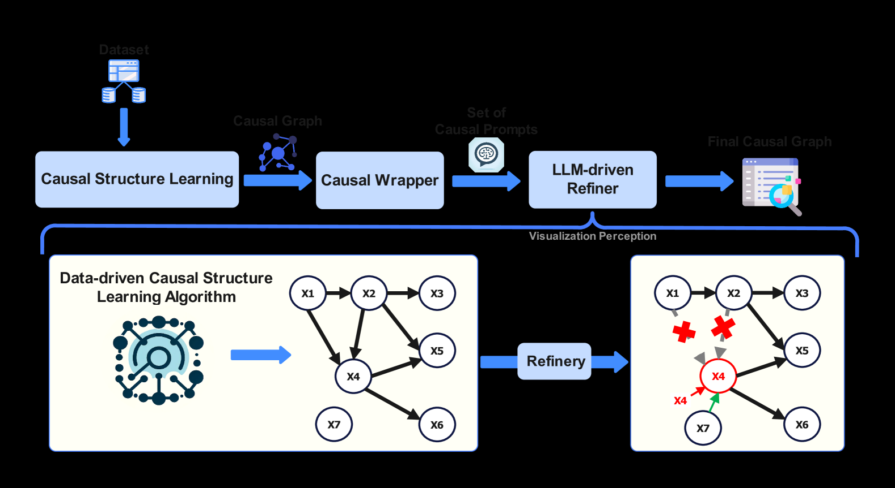
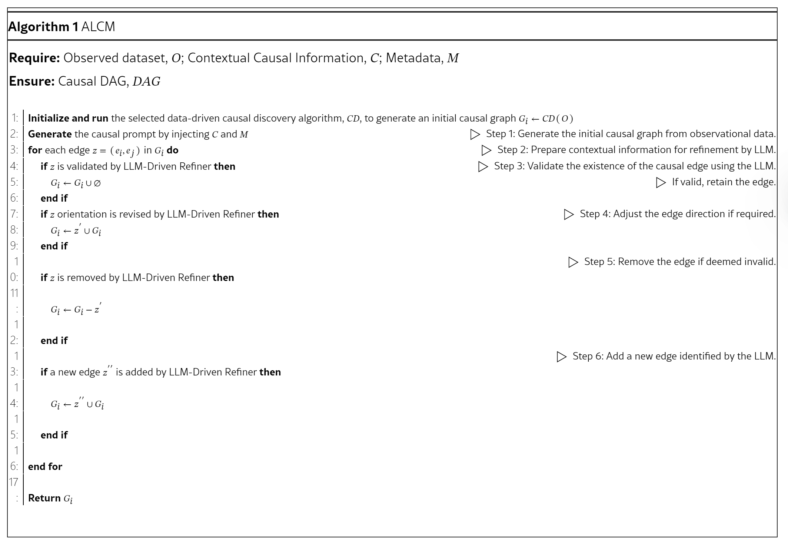
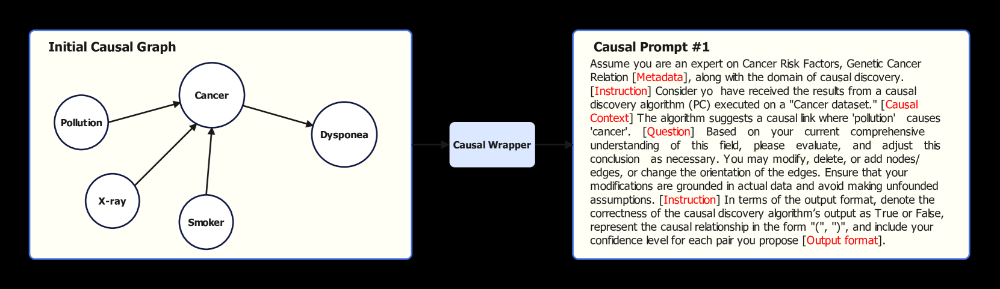

# ALCM: Autonomous LLM-Augmented Causal Discovery Framework

## Conventional data-driven causal discovery algorithms: 

conventional data-driven causal discovery algorithms are broadly classified into five categories as follows:

• **Score-Based Algorithms**: They operate on scores and engage in a comprehensive exploration of the entire space of potential Directed Acyclic Graphs (DAGs) to identify the most suitable graph for explaining the underlying data. Typically, such score-based approaches consist of two integral components: (i) a systematic search strategy tasked with navigating through the potential search states or the space of candidate graphs, denoted as G’, and (ii) a score function designed to evaluate the viability of these candidate causal graphs. The synergy between the search strategy and the score function is instrumental in optimizing the exploration of all conceivable DAGs. A widely employed score function in the selection of causal models is the Bayesian Information Criterion (BIC). Some examples of score-based algorithms are Greedy Equivalence Search (GES), Fast Greedy Search (FGS), and A* Search.

• **Constraint-Based Algorithms**: This category, exemplified by Peter-Clark (PC) algorithm, employs conditional independence (CI) tests to reveal the graph’s skeleton and v-structures, ultimately returning the Directed Acyclic Graph (DAG) of the functional causal model while considering v-structures and doing edge-orientations. Other constraint-bsaed algorithms are like Fast Causal Inference (FCI), Anytime FCI, RFCI, PC-stable, and so forth.

• **Hybrid Algorithms**: Hybrid approaches are founded on the integration of various causal discovery methods, combining constraint-based, score-based, Functional Causal Model (FCM)-based, gradient-based, and other techniques. This amalgamation reflects a comprehensive strategy that leverages the strengths of different methodologies to enhance the robustness and effectiveness of causal discovery in complex systems. Max-Min Hill Climbing (MMHC)–belonging to this category–stands out as a hybrid causal discovery technique that seamlessly integrates principles from both score-based and constraint-based algorithms. This hybrid approach combines the advantages of scoring methods and constraint-based strategies, offering a comprehensive and effective framework for uncovering causal relationships in complex systems.

• **Function-Based Algorithms**: Approaches grounded in Functional Causal Models (FCM) delineate the causal connections between variables within a defined functional structure. In FCMs, variables are expressed as functions of their direct causes (parents), augmented by an independent noise term denoted as E. The distinguishing feature of FCM-based methodologies lies in their capacity to differentiate between various Directed Acyclic Graphs (DAGs) within the same equivalence class. This discrimination is achieved by introducing supplementary assumptions concerning data distributions and/or function classes. Several notable FCM-based causal discovery methodologies are introduced, including Linear Non-Gaussian Acyclic Model (LiNGAM) and Structural Agnostic Modeling (SAM). SAM employs an adversarial learning methodology for causal graph identification. Specifically, SAM utilizes Generative Adversarial Neural Networks (GANs) to seek a Functional Causal Model (FCM) while ensuring the detection of sparse causal graphs through the incorporation of appropriate regularization terms. The optimization process involves a learning criterion that integrates distribution estimation, sparsity considerations, and acyclicity constraints. This holistic criterion facilitates end-to-end optimization of both the graph structure and associated parameters, accomplished through stochastic gradient descent.
The previous three-mentioned categories may be limited to the Markov equivalence class, posing constraints. Function-based algorithms like LiNGAM aim to uniquely identify causal DAGs by exploiting data generative process asymmetries or causal footprints.

• **Optimization-Based Algorithms**: Recent investigations in causal discovery have approached the structure learning problem by casting it as a continuous optimization task, employing the least squares objective and an algebraic representation of Directed Acyclic Graphs (DAGs). Notably, this transformation converts the combinatorial nature of the structure learning problem into a continuous framework, and solutions are obtained through the application of gradient-based optimization techniques. These methods exploit the gradients of an objective function concerning the parameterization of a DAG matrix to achieve effective structure learning. NOTEARS is among the causal discovery algorithms that formulate the structure learning problem as a purely continuous constrained optimization task.

## Architecture

## Causal Structure Learning

Hybrid:

The PC method employs conditional independence (CI) tests to iteratively construct a causal graph by building its skeleton and identifying v-structures. This method is particularly effective for datasets with mixed discrete and continuous variables and excels in capturing probabilistic dependencies. Its iterative and constraint-based nature ensures computational efficiency, even in high-dimensional settings. In contrast, LiNGAM is specifically designed to uncover linear causal relationships in datasets with non-Gaussian distributions. By leveraging Independent Component Analysis (ICA), LiNGAM accurately identifies causal ordering and orients edges with high precision, even in the presence of latent confounders and linear dependencies. NOTEARS complements these approaches by reformulating causal discovery into a continuous optimization problem. By incorporating a differentiable acyclicity constraint, NOTEARS transforms the combinatorial problem of DAG discovery into a solvable optimization task, making it highly effective for datasets with intricate causal dependencies and scalable to high-dimensional data.

To leverage the unique strengths of these methods, we propose a hybrid approach that combines their outputs using dynamically assigned weights. These weights are determined based on a composite score for each method, which captures its performance on a given dataset. The composite score is defined as the difference between the Accuracy and NHD, balancing edge-specific performance and structural alignment with the ground truth. Formally, the composite score for a method is given by:

$Composite_{method} = Accuracy_{method}−NHD_{method}$

> 在因果图评估中，我们通常比较预测图 $G_p$ 和真实图 $G$，两者都有 $m$ 个节点。所有可能的有向边数量为 $N = m(m-1)$（假设没有自环）。基于混淆矩阵的概念，我们可以定义：
> - **TP（真阳性）**：正确预测存在的边（即 $G$ 和 $G_p$ 中都为 1 的边）。
> - **TN（真阴性）**：正确预测不存在的边（即 $G$ 和 $G_p$ 中都为 0 的边）。
> - **FP（假阳性）**：错误预测存在的边（即 $G$ 中为 0 但 $G_p$ 中为 1 的边）。
> - **FN（假阴性）**：错误预测不存在的边（即 $G$ 中为 1 但 $G_p$ 中为 0 的边）。
> 
> 然后，$(\text{Accuracy})$ 和 $(\text{NHD})$ 的计算如下：
> - $\text{Accuracy} = \frac{TP + TN}{N}$
> - $\text{NHD} = \frac{FP + FN}{N}$

> 因此，公式变为：
> $\text{Composite} = \text{Accuracy} - \text{NHD} = \frac{TP + TN}{N}- \frac{FP + FN}{N} = \frac{(TP + TN) - (FP + FN)}{N}$

> 由于 $TP + TN + FP + FN = N$，我们可以简化：
> $(TP + TN) - (FP + FN) = (TP + TN) - (N - TP - TN) = 2(TP + TN) - N$
> 所以：
> $\text{Composite} = \frac{2(TP + TN) - N}{N} = 2 \cdot \text {Accuracy} - 1$

>这意味着 $\text{Composite}$ 实际上是 $2 \cdot \text{Accuracy} - 1$，其值范围在 $[-1, 1]$。当 $\text{Accuracy} = 1$ 时，$\text{Composite} = 1$; 当 $\text{Accuracy} = 0.5$ 时，$\text{Composite} = 0$; 当 $\text{Accuracy} = 0$ 时，$\text{Composite} = -1$.

>要计算 $\text{Composite}_{\text{method}}$，需要以下步骤：
>1. **构建邻接矩阵**：将真实图 $G$ 和预测图 $G_p$ 表示为 $m \times m$ 的邻接矩阵，其中元素 $1$ 表示存在边，$0$ 表示不存在边。
>2. **计算 TP, TN, FP, FN**：通过比较两个邻接矩阵的每个元素：
>   - TP：两个矩阵都为 $1$ 的位置数。
>   - TN：两个矩阵都为 $0$ 的位置数（不包括对角线，如果禁止自环）。
>   - FP：$G$ 为 $0$ 但 $G_p$ 为 $1$ 的位置数。
>   - FN：$G$ 为 $1$ 但 $G_p$ 为 $0$ 的位置数。
>3. **计算 $N$**：所有可能边的数量，$N = m(m-1)$。
>4. **计算 $\text{Accuracy}$**：$\text{Accuracy} = \frac{TP + TN}{N}$.
>5. **计算 $\text{Composite}$**：$\text{Composite} = 2 \cdot \text{Accuracy} - 1$.

>$\text{Composite}$ 得分提供了一个综合衡量预测图与真实图相似度的指标。正值表示预测优于随机（Accuracy > 0.5），负值表示预测差于随机（Accuracy < 0.5）。

This score accounts for both the overall correctness of edge identification (via Accuracy) and the structural similarity of the causal graph (via NHD), ensuring that methods achieving both accurate and well-aligned graphs are given higher importance. The weights are derived by normalizing the composite scores across all methods:

$W_{method} = \frac{Composite_{method}}{\sum_{all methods}Composite_{method}}$

where $W_{method}$ represents the weight assigned to a method, ensuring that the sum of all weights equals one.

To further enhance the adaptability of the hybrid approach, we introduce a neural network-based architecture to dynamically learn these weights based on both method performance metrics and dataset-specific features. The neural network is designed to take as input the composite scores of the methods, along with features such as graph density, node degree distribution, and sparsity. Graph density quantifies how connected the graph is and is defined as the ratio of the number of edges to the maximum possible edges. Node degree distribution describes the variability in the number of connections per node, while sparsity measures the proportion of missing edges compared to a fully connected graph.

The architecture of the neural network consists of three layers: 1. An input layer with nine features, including the composite scores of the methods ($Composite_{PC},Composite_{LiNGAM},Composite_{NOTEARS}$
) and six dataset-specific features such as graph density, average node degree, and sparsity. 2. Two hidden layers with 64 and 32 neurons, respectively, each using the Rectified Linear Unit (ReLU) activation function to capture non-linear relationships among the features. 3. An output layer with three neurons (one for each method), using a softmax activation to produce normalized weights for the methods. Formally, the neural network outputs the weights as follows:

$W = Softmax \left( H _ { 2 } \cdot W _ { O } + b _ { O } \right)$

where 𝐇2 represents the outputs from the second hidden layer, 𝐖o and 𝐛o are the weights and biases of the output layer, and Softmax ensures the weights sum to one.

The neural network is trained on a dataset comprising simulated graphs with varying densities, node degrees, and sparsity levels. For each graph, the outputs of PC, LiNGAM, and NOTEARS are evaluated using Accuracy and NHD, and the composite scores are computed. The ground-truth weights for training are derived by normalizing these composite scores as described in Equation (3). The training objective minimizes the mean squared error (MSE) between the predicted weights and the ground-truth weights. Using the dynamically learned weights, the hybrid approach synthesizes a causal graph by aggregating the outputs of PC, LiNGAM, and NOTEARS. For each edge e
, the final score is computed as:

$Score_{e} =\sum_{method} W_{method} \cdot 𝟙_{method(e)}$

Here, $𝟙_{method(e)}$ is an indicator function that equals 1 if the edge e is identified by the method and 0 otherwise. Edges with scores exceeding a predefined threshold are retained in the hybrid causal graph. For edges uniquely identified by only one method, one LLM is employed as a decisive layer. The LLM evaluates these edges based on contextual knowledge and causal reasoning to ensure that only plausible causal links are included. The validated edges are then added to the hybrid graph, enhancing its comprehensiveness and accuracy.

> Normalized Hamming Distance (NHD): quantifies the difference between the predicted causal graph and the ground truth by measuring the proportion of mismatched edges, adjusted for the size of the graph. NHD is instrumental in assessing the structural similarity of the causal graphs, offering insights into the nuanced differences that may not be captured by other metrics. In the context of a graph with m nodes, the NHD between the predicted graph G p and the ground-truth graph G is determined by calculating the number of edges that exist in one graph but not the other. This count is then divided by the total number of all possible edges–this formula is defined in Equation 6. In essence, the NHD provides a normalized measure of dissimilarity, offering insights into the accuracy of the predicted graph compared to the ground-truth graph, accounting for the total potential edges in the graph with m nodes.
> 
> $N H D = \sum_{i=1}^m \sum_{j=1}^m \frac{1}{m^2} \cdot 1,$where  $G_{ij} \neq G_{p_{ij}}$

## Causal Wrapper

Equation 1 shows our causal-aware prompting strategy by infusing the context of problem and metadata information into the prompts. This prompting strategy was inspired by an effort by Kim et al.. They demonstrated that contextual information is important in boosting the overall performance of LLMs’ responses.

$Causal_{prompt}=Instruction+Causal Context+Metadata+Question+Output format$

This enhancement is accomplished by incorporating explicit elements into the prompt, with each edge being transformed into a causal prompt structured as follows:

Instructions: This section clarifies the role of LLMs, their objectives, and the expected behavior. Causal Context: It includes details about the selected causal discovery algorithm, such as its name and output. Metadata: This section outlines the dataset domain or variable names along with their descriptions. Question: It specifies the precise query, for example, whether A causes B. Output format: This delineates the desired format for the output.

## LLM-Refiner

The LLM-driven Refiner leverages advanced language models in the refinement and evaluation of causal graphs. This component receives a series of intricately designed, contextual causal prompts from the causal wrapper component, which serve as a nuanced guide for its operations.

The LLM-driven Refiner evaluates each edge and node in the graph by applying advanced reasoning capabilities of LLMs (e.g., GPT-4). The process involves:

1. Assessing the validity of existing causal relationships using contextual knowledge.
2. Detecting and integrating hidden causal relationships by reasoning over unobserved variables.
3. Reorienting or removing edges that do not align with domain knowledge or probabilistic dependencies.
4. Assigning confidence scores or likelihood estimates to refined relationships, ensuring interpretability and reliability.