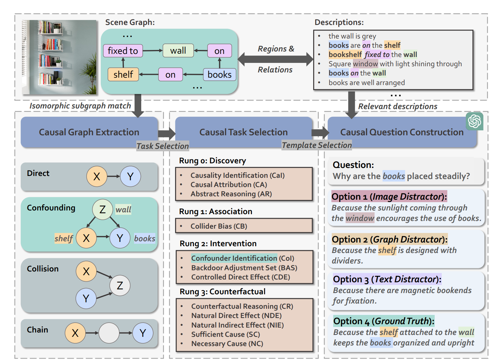

# CELLO: Causal Evaluation of Large Vision-Language Models

## Dataser Construction Pipeline

First, we extract causal graphs from scene graphs that include relationships and regions within an image. Then, we select
corresponding causal tasks based on the ladder of causation. Finally, causal questions are constructed by employing
templates with an LLM. We consider four types of causal graphs and twelve different causal tasks in total.

Specifically,we divide the pipeline into 3 aspects.

### Causal Graph Extraction

Preprocess Visual Genome Dataset(it has comprehensive suite of images along with corresponding scene graphs):
Specifically, we first catalog and analyze every
relationship type present in Visual Genome, with a
focus on those signifying arrangement, positioning,
and other significant interactions, such as those labeled “support”, “fixed to”, and “hold”. Then, we
compile a set of graph templates drawn from multiple sources in the literature,including direct, confounding,
collision, and chain.These
templates illustrate various toy problems in causal
reasoning using well-defined graph structures. Finally, we perform isomorphic subgraph matching
against these predefined templates to determine the
type of causal graph extracted.

### Causal Task Selection

Select 12 tasks in 4 rungs in ladder of causation.

**Discovery (Rung 0).** We include causal tasks
such as causality identification (CaI, e.g., “Which
of the following elements is crucial for the girl’s
safety?”), causal attribution (CA, e.g., “What indirectly causes the balloon’s stability?”), and abstract reasoning (AR, e.g., “What is indirectly
influenced by the wave’s force?”).

**Association (Rung 1).** We consider collider bias
(CB, e.g., “Why don’t the balloons fly away?”).

**Intervention (Rung 2).** We inquire about confounder identification (CoI, e.g., “Why are the
books placed steadily?”), backdoor adjustment
set (BAS, e.g., “To assess the relationship between
the solidity of shelves and the stability of books,
which of the following variables should we control
for? ”), and controlled direct effect (CDE, e.g., “If
the state of the wall is not changed and the shelves
become unstable, will the books drop?”).

**Counterfactual (Rung 3).** We explore counterfactual scenarios such as counterfactual reasoning (CR, e.g., “If the shelf has fallen down, would
the books still be placed steadily?”), natural direct effect (NDE, e.g., “If the retainer of the shelf
has been removed, would the books drop?”), natural indirect effect (NIE, e.g., “If the shelf has
been fixed to a unstable wall, would the books stay
steady?”), sufficient cause (SC, e.g., “If the wall has fallen down, would the books drop?”), and necessary cause (NC, e.g., “If the balloons has flown
away, would the woman let go?”).

### Causal Question Construction

**Question Construction :** Prompt LLM to generate causal questions bt applying in-context learning.

Follow 3 instructions:

The demonstration provides: 

(1) *Relevant descriptions*, which are
extracted from the dataset descriptions that are associated with the core entities. For instance, “books
are on the shelf ”
 
(2) *Causal graph*, which is constructed through the process of
Section 4.1. Each edge of the graph is expressed
in textual form, such as “shelf supports books”.

(3) *Constraints*, which ensure the validity of the
question and prevent information leakage, such as
“do not include ‘shelf’ or ‘wall’ in your generated
question”.

**Answer Construction:** 

Two Settings:
(1) *Multiple-Choice Format*,3 distractors and 1 correct answer.
The three distractors are
constructed using the entities based on the following constraints: 

(1) Irrelevant entities (Image Distractor): These entities are present in the image
but absent from the causal graph, such as “window”. 

(2) Partially correct entities (Graph Distractor): These entities are present in the causal
graph but only represent part of the correct answer,
such as “shelf”. 

(3) Induced entities (Text Distractor): These entities are neither in the image nor
in the causal graph but introduced solely from the
question text, such as “bookends”. This distractor
can also be seen as a object hallucination

(2) *Binary Answer* : Yes or No.
