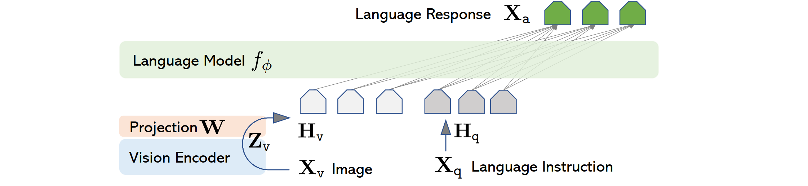

# Llava论文: Visual Instruction Tuning

## Architecture

Use GPT4 to generate dataset with VQA.As GPT4 is a purely languange model,we take captions and bounding boxes as the input to GPT,and thus generate 3 types of Q-A pairs.
They're like $\textbf{X}_q \ \textbf{X}_v\text{<STOP> Assistant:} \textbf{X}_C \text{<STOP>}$ 

