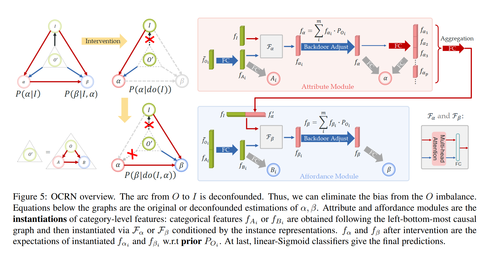
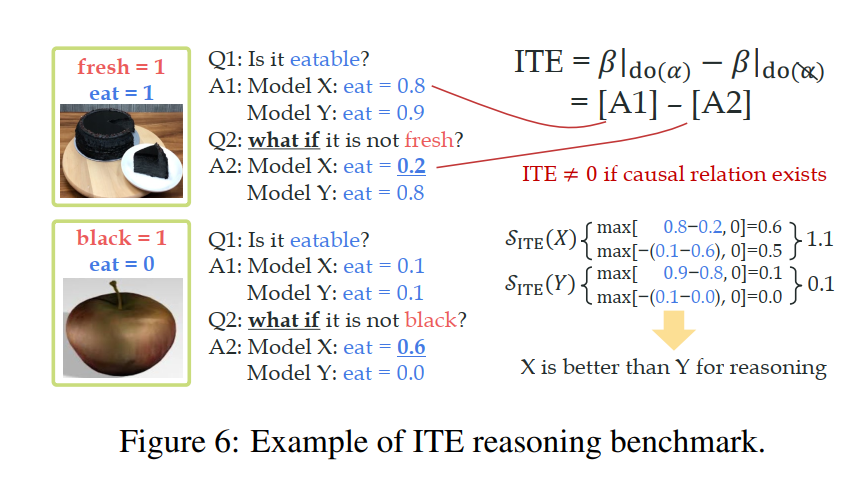

# OCL论文精读

## 模型架构

## 实现细节

OCL can be depicted as $P(\alpha | I)$ and $P(\beta | I,\alpha)$. In $P(\alpha|I)$,category bias is imported following: 
$P(\alpha|I) = \sum_i^m P(\alpha|I,O_i)P(O_i|I)$,where $P(O_i|I)$ is the predicted category probability.O is a confounder and pollutes attribute inference,especially for the rare categories.

We need to intervene to deconfounf the confounder O for $\alpha$.
In $\alpha$ estimation, we use $do(\cdot)$ operation to eliminate the arc from O to I:

$$
\begin{align}
P(\alpha|do(I)) &= \sum_i^m P(\alpha|I,O_i)P(O_i) \\
&\quad \because \text{ O到I的边已经切断} \\
&= \sum_i^m P(O_i) \sum_j^m P(\alpha|I,O_i,A_j) P(A_j|I,O_i) \\
&= \sum_i^m P(O_i) \sum_j^m P(\alpha|I,A_j) P(A_j|O_i) \\
&\quad \because A_j\text{完全由}O_i\text{决定，与图像I无关；} \\
&\quad \quad \text{一旦给定}A_j\text{，类别}O_i\text{将对}\alpha\text{不再提供任何信息} \\
&= \sum_i^m P(\alpha|I,A_i) P(O_i) \\
&\quad \because \text{只有当}i=j\text{时}P(A_j|O_i)=1
\end{align}
$$

$P(O_i)$ is the prior probability of the i-th catrgory(frequency on the train set).

Similarly,$P(\beta|I,\alpha) = \sum_i^m P(\beta|I,O_i,\alpha)P(O_i|I,\alpha)$.

$P(\beta|do(I,\alpha))=\sum_i^m P(\beta|I,\alpha,B_i) P(O_i)$

We represent nodes ${I, A, B, α, β}$ as ${f_I, f_A, f_B, f_α,
f_β}$ respectively in latent space. $f_I$ is the RoI pooling
feature of an instance extracted by a COCO pre-trained
ResNet-50. We represent categorylevel attribute A based on the mean object category feature $\bar{f_{O_i}}$, which is the mean of f$_I$ of all training samples in category $O_i$. We map $\bar{f_{O_i}}$ to the attribute latent space fAi
with fully-connected layers (FC) . $f_{A_i}$ stands for
the category-attribute representation for ith category.

**Attribute Instantiation.** Next, we obtain an α representation following Eq. 4:

 $f_{\alpha_i} = \mathcal{F}_\alpha(f_I, f_{A_i}), \quad f_\alpha = \sum_i^m f_{\alpha_i} \cdot P_{O_i}$

where  $P_{O_i}$ is the prior category probability. Eq. 7 indicates the attribute instantiation from  $A$ to  $\alpha$ with  $I$ as the condition. Hence, we can equally translate the  $\alpha$ estimation problem into a conditioned instantiation problem.  $\mathcal{F}_\alpha(\cdot)$ is implemented with multi-head attention with two entries . The attention output is compressed by a linear layer to the instantiated representation  $f_{\alpha_i}$. The debiased representation  $f_\alpha$ is the expectation of  $f_{\alpha_i}$ w.r.t  $P_{O_i}$, according to back-door adjustment in Eq. 4.

We also define the feature for specific attributes for ITE operation.  $f_\alpha$ is first separated to  $f_{\alpha_p}$ for each attribute  $p \in [1, 114]$ by multiple independent FCs, then we can manipulate specific attributes by masking some certain  $f_{\alpha_p}$. Next, the features are aggregated via concatenating-compressing by an FC to  $f'_\alpha$ as shown in Fig. 5.

**Affordance Instantiation.** Similarly, FCs are used to obtain  $f_B$ from  $\bar{f}_{O_i}$ and  $f_{A_i}$:

$f_{\beta_i} = \mathcal{F}_\beta(f_I, f'_\alpha, f_{B_i}), \quad f_\beta = \sum_i^m f_{\beta_i} \cdot P_{O_i}.$

 $\mathcal{F}_\beta(\cdot)$ operates instantiation with conditions  $\{f_I, f'_\alpha, f_{B_i}\}$.

## ITE Metrics

**α, β Recognition:** we measure the correctness of model prediction  $\hat{\alpha}$ and  $\hat{\beta}$. For multi-label classification tasks, we use the mean Average Precision (mAP) metric.

**Reasoning:** we use **Individual Treatment Effect (ITE)** .  $ITE_i = Y_{i,T=1} - Y_{i,T=0}$ measures the causal effect  $T \rightarrow Y$ of  $i^{th}$ individual with the difference between outcomes ( $Y$) with or without receiving the treatment ( $T$). In OCL, we discuss the causal relation between  $p^{th}$ attribute and  $q^{th}$ affordance:  $\alpha_p \rightarrow \beta_q$. So we interpret the treatment  $T$ as the **existence of  $\alpha_p$** and the outcome  $Y$ as the  $\beta_q$ output. We measure the difference of  $\beta_q$ output when the whole  $\alpha_q$ feature is wiped out or not, which should be non-zero when the causal relation  $\alpha_p \rightarrow \beta_q$ exists.

In detail, given a model, for an instance with causal relation  $\alpha_p \rightarrow \beta_q$ ( $p \in [1, 114], q \in [1, 170]$), we first formulate ITE as the affordance probability change following Eq. 2:

$ITE = \Delta \hat{\beta}_q = \hat{\beta}_q|_{do(\alpha_p)} - \hat{\beta}_q|_{do(\cancel{\alpha_q})}$

 $\hat{\beta}_q|_{do(\alpha_p)}$ is the factual output of the affordance probability.  $\hat{\beta}_q|_{do(\cancel{\alpha_q})}$ is the counterfactual output when the  $\alpha_p$ is wiped out, which can be got by assign zero-mask [65] to the feature of  $\alpha_p$ (e.g.,  $f_{\alpha_p}$ in OCRN) and keep the other features. Then, based on ITE, we benchmark instances following:

**ITE:** If the causality  $\alpha_p \rightarrow \beta_q$ exists on the instance, ITE should be non-zero when eliminating the effect of  $\alpha_p$. And the direction of ITE depends on the affordance ground-truth  $\beta_q$: if  $\beta_q = 0$, the predicted  $\hat{\beta}_q$ tend to be 1 after wiping out  $\alpha_p$ so ITE should be a negative value; contrarily, ITE should be positive if  $\beta_q = 1$. Hence we compute the ITE score as:

$S_{ITE} = \left\{
  \begin{array}{ll}
    \max(\Delta \hat{\beta}_q, 0), & \beta_q = 1, \\
    \max(-\Delta \hat{\beta}_q, 0), & \beta_q = 0,
  \end{array}
\right.$

so that larger  $S_{ITE}$ indicates the model infers more accurate ITE directions and has better reasoning performance.

**α-β-ITE:** we combine recognition and reasoning performances. We multiply  $S_{ITE}$ with  $P(\hat{\alpha}_p = \alpha_p)$ and  $P(\hat{\beta}_q = \beta_q)$ as a unified metric  $S_{\alpha-\beta-ITE}$.

For all metrics, we compute AP for each  $[\alpha_p, \beta_q]$ and average them to mAP. Non-existing pairs are not considered.