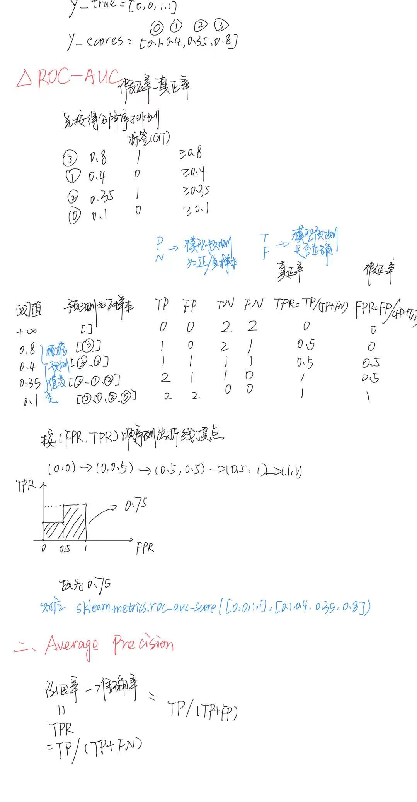
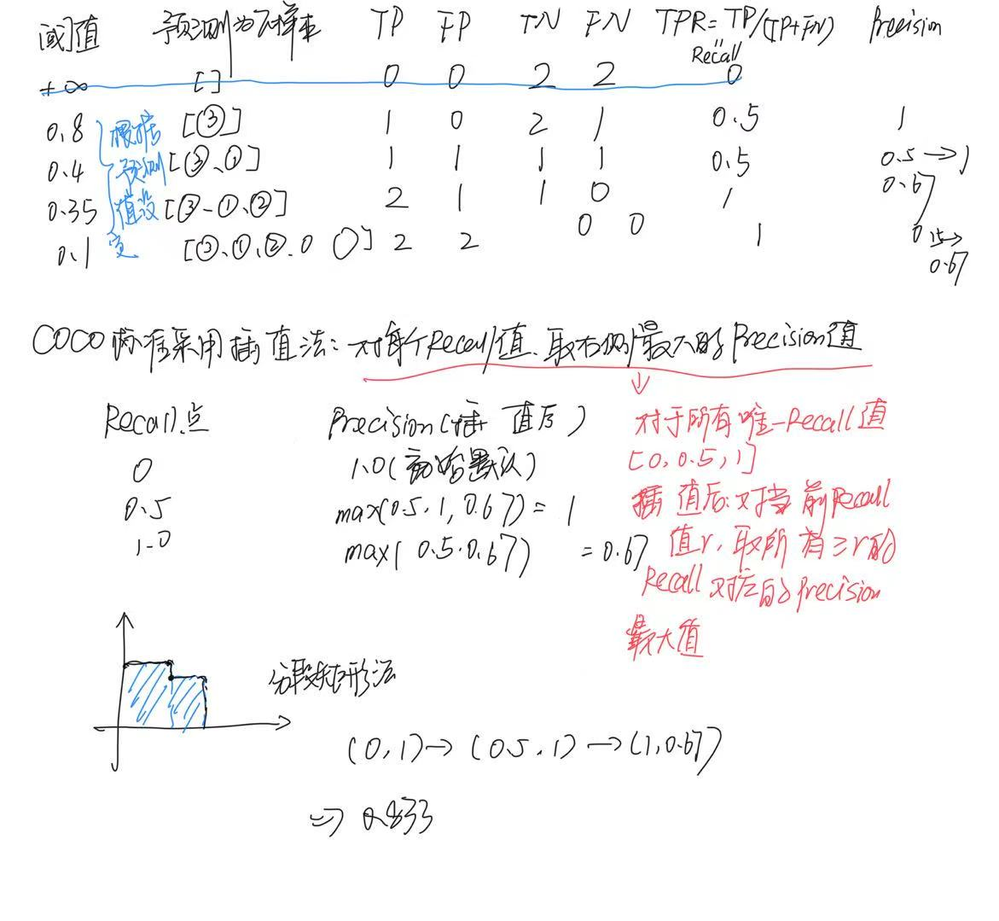

# mAP

```python
from sklearn.metrics import roc_auc_score, average_precision_score

y_true = [0, 0, 1, 1]
y_scores = [0.1, 0.4, 0.35, 0.8]

roc_auc = roc_auc_score(y_true, y_scores)
pr_auc = average_precision_score(y_true, y_scores)

print("ROC-AUC:", roc_auc)  # 输出：0.75
print("PR-AUC (AP):", pr_auc)  # 输出：0.83...
```





