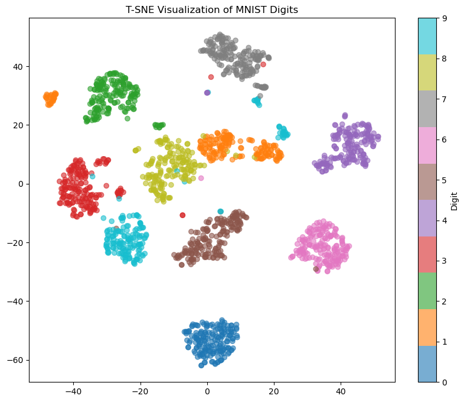

# t-SNE

```python

from sklearn.manifold import TSNE
from sklearn.datasets import load_digits
import matplotlib.pyplot as plt

# 加载数据（8x8图像的1797个手写数字）
digits = load_digits()
X = digits.data  # 高维数据 (1797, 64)
y = digits.target  # 真实标签 (0-9)

# T-SNE降维
tsne = TSNE(n_components=2, random_state=42)
X_tsne = tsne.fit_transform(X)  # 输出2D坐标 (1797, 2)

# 可视化
plt.figure(figsize=(10, 8))
scatter = plt.scatter(X_tsne[:, 0], X_tsne[:, 1], c=y, cmap='tab10', alpha=0.6)
plt.colorbar(scatter, label='Digit')
plt.title('T-SNE Visualization of MNIST Digits')
plt.show()

```



## 原理

### 1. 核心原理

T-SNE（t-Distributed Stochastic Neighbor Embedding）是一种非线性降维技术，主要用于**高维数据可视化**。其核心是通过概率建模保留数据的局部结构特征。

#### 关键特点

- **高维空间**：使用高斯分布计算点间相似度
- **低维空间**：改用t分布（自由度=1）避免"拥挤问题"
- **优化目标**：最小化KL散度（Kullback-Leibler Divergence）

### 2. 算法步骤

#### 步骤1：计算高维相似度

对于每个数据点$x_i$：
$$p_{j|i} = \frac{\exp(-||x_i - x_j||^2 / 2\sigma_i^2)}{\sum_{k \neq i} \exp(-||x_i - x_k||^2 / 2\sigma_i^2)}$$

对称化处理：
$$p_{ij} = \frac{p_{j|i} + p_{i|j}}{2n}$$

#### 步骤2：低维空间建模

在低维空间使用t分布：
$$q_{ij} = \frac{(1 + ||y_i - y_j||^2)^{-1}}{\sum_{k \neq l} (1 + ||y_k - y_l||^2)^{-1}}$$

#### 步骤3：梯度下降优化

损失函数：
$$KL(P||Q) = \sum_{i \neq j} p_{ij} \log \frac{p_{ij}}{q_{ij}}$$